# Entity Relationship Diagram (ERD)
## GuildHub - Project 1999 EverQuest DKP System

**Version:** 2.0 (P99-Focused)
**Date:** October 19, 2025
**Database:** PostgreSQL 16+
**Target:** Rails 8.x with ActiveRecord

---

## Table of Contents
1. [Overview](#overview)
2. [Complete ERD](#complete-erd)
3. [Domain-Specific ERDs](#domain-specific-erds)
4. [Table Definitions](#table-definitions)
5. [Key Design Decisions](#key-design-decisions)

---

## Overview

### Simplified Architecture for P99

The GuildHub database is **dramatically simplified** compared to EQdkpPlus:

**Included Domains:**
- ✅ **User & Discord Auth**: Discord OAuth, minimal admin panel
- ✅ **Guild & Character Management**: P99-specific EverQuest data
- ✅ **Single DKP Pool**: Simplified point tracking
- ✅ **Raid & Attendance**: P99 raid types
- ✅ **Item Awards**: Loot tracking
- ✅ **Announcements**: Simple guild posts
- ✅ **Audit Trail**: PaperTrail versions

**Removed Domains (vs EQdkpPlus):**
- ❌ **Calendar & Event Signups**: P99 guilds use Discord
- ❌ **Multiple DKP Pools**: Single pool via JSONB config
- ❌ **Portal System**: Simple dashboard only
- ❌ **Plugin System**: Core features only
- ❌ **Theme System**: Tailwind CSS only
- ❌ **Multi-game Support**: P99 EverQuest only

### Entity Count Comparison

| System | Tables | Complexity |
|--------|--------|------------|
| **EQdkpPlus** | 40+ tables | High (multi-game, plugins, themes) |
| **GuildHub (P99)** | ~10 core tables | Low (focused DKP tracking) |

---

## Complete ERD

### Core System Overview

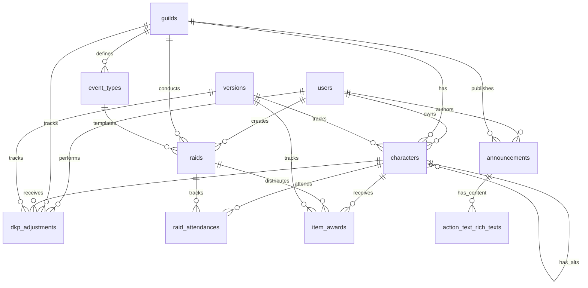

---

## Domain-Specific ERDs

### 1. User & Discord Authentication Domain

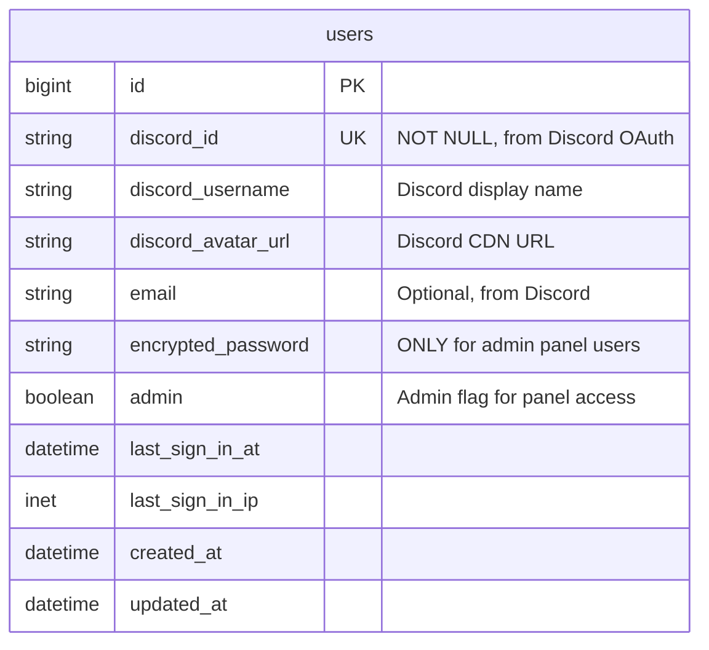

**Key Design Decisions:**
- `discord_id` is the primary authentication identifier (unique)
- `encrypted_password` only populated for admin panel users (Devise)
- No separate sessions table (Rails handles via cookies)
- No complex permission system (simple admin boolean)

**Authentication Flow:**
1. **Regular Users**: Discord OAuth → auto-create user with discord_id
2. **Admin Users**: Username/password via Devise (admin=true)

---

### 2. Guild Domain

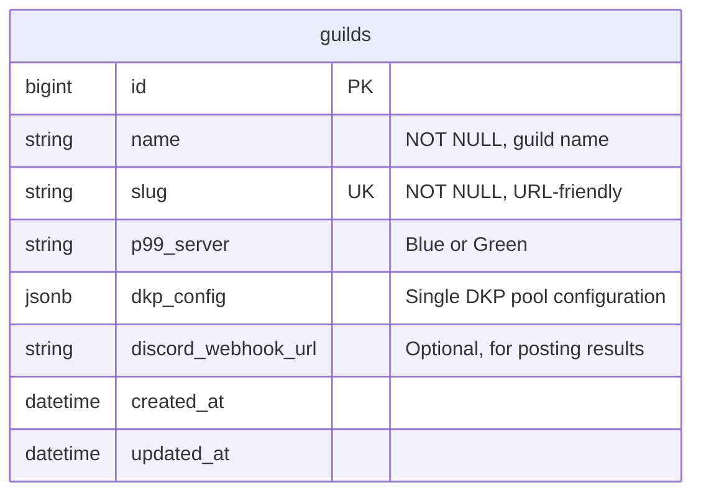

**DKP Config JSONB Structure:**
```json
{
  "pool_name": "Main Raid DKP",
  "starting_balance": 0,
  "allow_decimals": false,
  "decay_enabled": false,
  "decay_percent": 0,
  "decay_period": "monthly",
  "point_cap": null,
  "minimum_balance": null
}
```

**Why JSONB instead of separate table?**
- Only ONE DKP pool per guild (no need for separate table)
- Flexible configuration without schema changes
- PostgreSQL JSONB is fast and indexable

---

### 3. Character Domain (P99-Specific)

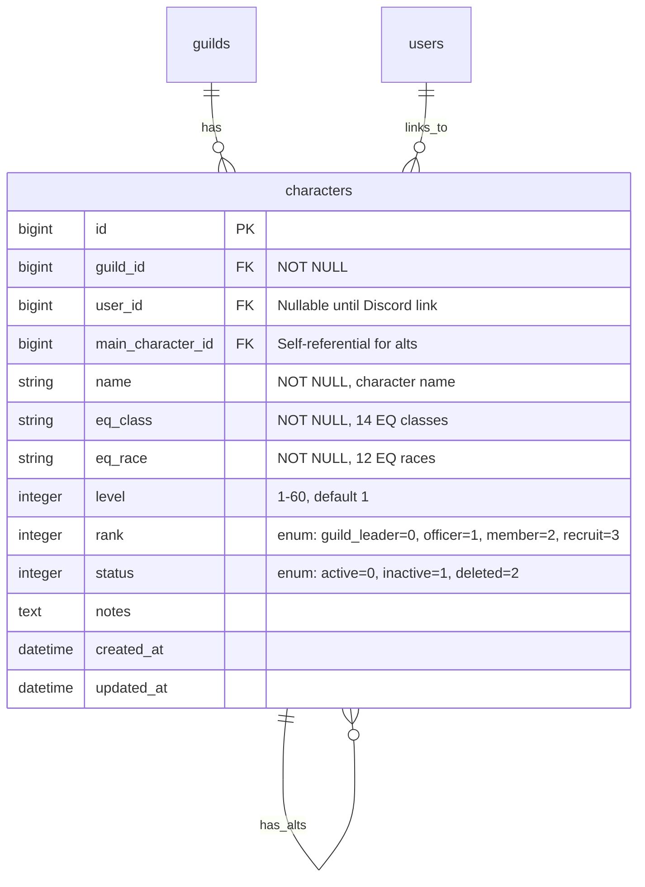

**EverQuest Classes (14):**
- Tanks: Warrior, Paladin, Shadow Knight
- Healers: Cleric, Druid, Shaman
- Melee DPS: Monk, Rogue, Ranger, Bard
- Casters: Wizard, Magician, Necromancer, Enchanter

**EverQuest Races (12):**
- Human, Barbarian, Erudite, Wood Elf, High Elf, Dark Elf, Half Elf, Dwarf, Troll, Ogre, Halfling, Gnome

**Ranks (Simplified):**
- 0: Guild Leader (full permissions)
- 1: Officer (manage raids, DKP)
- 2: Member (view only)
- 3: Recruit (limited view)

---

### 4. DKP System Domain (Simplified)

#### Event Types (Raid Templates)

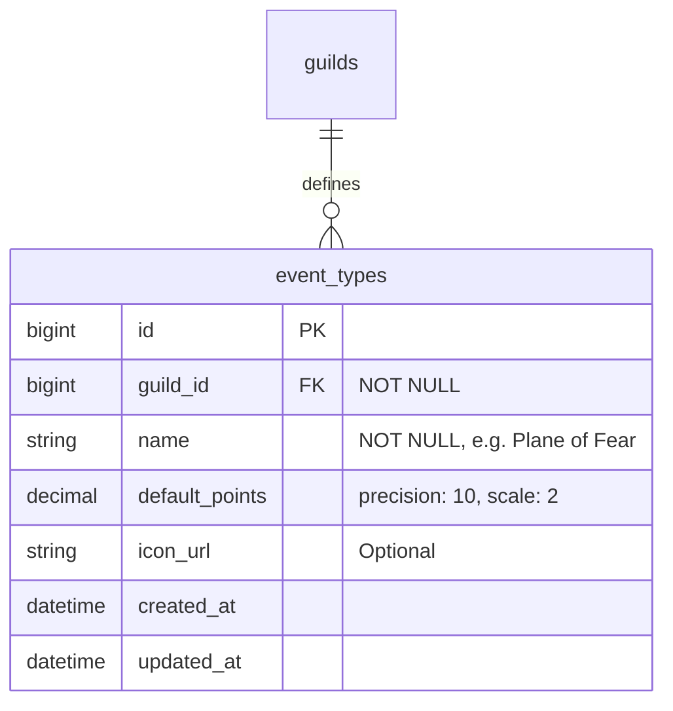

**Example P99 Event Types:**
- Plane of Fear (PoF) - 3 points
- Plane of Hate (PoH) - 3 points
- Plane of Sky (PoS) - 5 points
- Nagafen - 2 points
- Vox - 2 points
- Innoruuk - 2 points
- Cazic-Thule - 2 points
- Custom event types

#### Raids

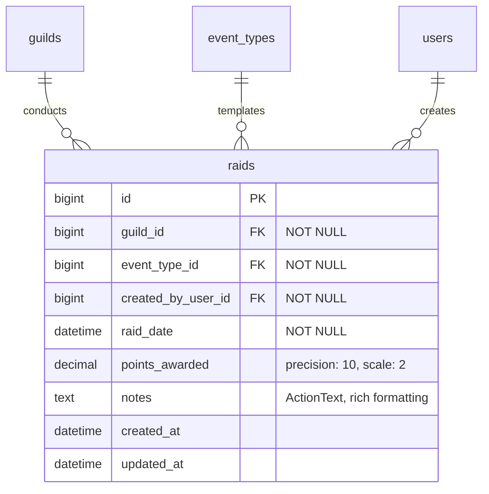

#### Raid Attendance

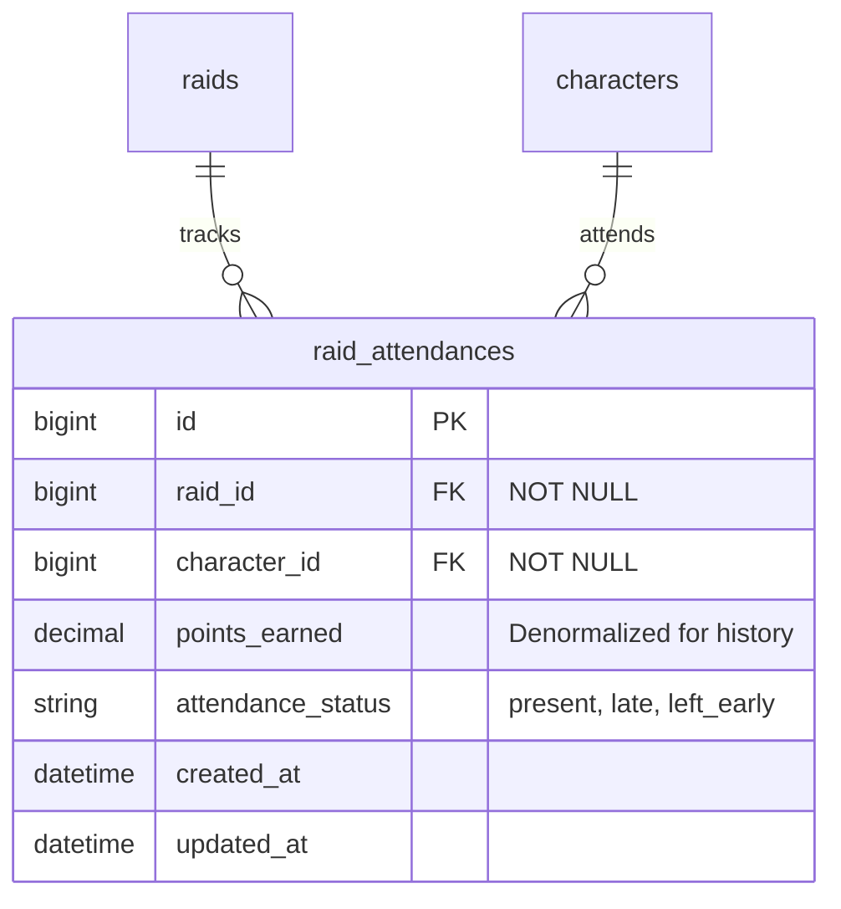

**Unique Index:** `[raid_id, character_id]` - prevent duplicate attendance

**Denormalized points_earned:**
- Stores point value at time of raid
- Preserves history even if guild changes DKP rules
- Enables accurate historical reporting

#### Item Awards (Loot)

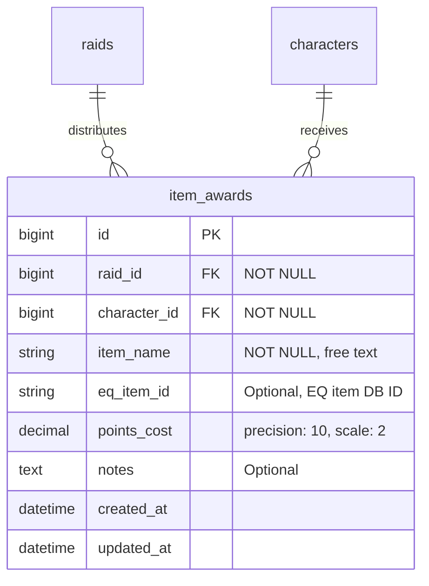

**Item Tracking:**
- `item_name`: Free text (required)
- `eq_item_id`: Optional link to EQ item database (future enhancement)
- `points_cost`: DKP spent (can be 0 for free loot)

#### DKP Adjustments (Manual)

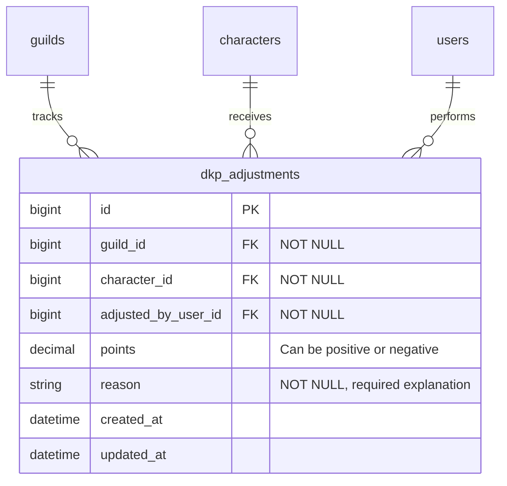

**Use Cases:**
- Decay application: Negative adjustment for all characters
- Bonus points: Positive adjustment
- Corrections: Fix mistakes
- Penalties: Remove points

**Audit Trail:**
- All adjustments tracked via PaperTrail (versions table)
- `adjusted_by_user_id` shows who made the change
- `reason` field required for accountability

---

### 5. DKP Calculation (Virtual)

**No dedicated points table** - DKP is calculated on-the-fly:

```ruby
# app/services/dkp/calculator_service.rb
def current_balance(character)
  starting_balance = character.guild.dkp_config['starting_balance'] || 0

  earned = character.raid_attendances.sum(:points_earned)
  spent = character.item_awards.sum(:points_cost)
  adjustments = character.dkp_adjustments.sum(:points)

  starting_balance + earned - spent + adjustments
end
```

**Why calculated vs. stored?**
- ✅ Single source of truth (transaction history)
- ✅ Easy to audit and debug
- ✅ Supports rollback/corrections
- ✅ No data consistency issues
- ⚠️ Cached in Redis for performance (5-minute TTL)

---

### 6. Content Domain (Simplified)

#### Announcements

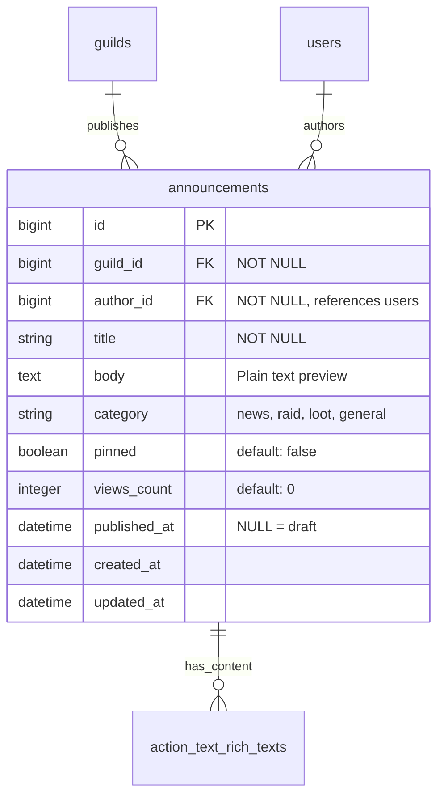

**ActionText Integration:**
- Rich text content stored in `action_text_rich_texts` table (Rails built-in)
- `body` field stores plain text for previews/search
- No separate comments table initially (can add later if needed)

---

### 7. Audit Trail (PaperTrail)

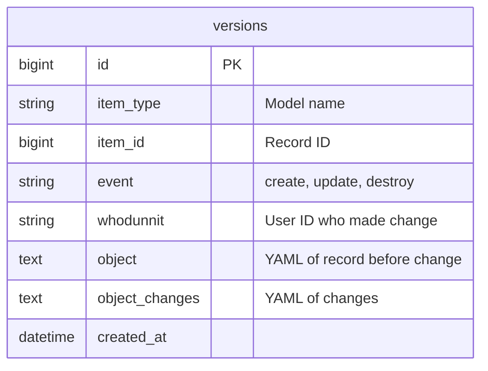

**Audited Models:**
- `Character` - track rank changes, status changes
- `DkpAdjustment` - all point adjustments
- `ItemAward` - loot awards and rollbacks
- `Raid` - raid modifications
- `RaidAttendance` - attendance changes

---

## Table Definitions

### Core Tables Summary

| Table Name | Primary Purpose | Record Volume (per guild) |
|------------|-----------------|---------------------------|
| **users** | Discord OAuth + admin users | 50-200 users |
| **guilds** | Guild configuration | 1 (per guild instance) |
| **characters** | EQ characters | 100-500 characters |
| **event_types** | Raid templates | 10-20 event types |
| **raids** | Raid instances | 500-2000 raids/year |
| **raid_attendances** | Attendance records | 20k-80k/year |
| **item_awards** | Loot history | 5k-20k/year |
| **dkp_adjustments** | Manual adjustments | 100-500/year |
| **announcements** | Guild news | 50-200/year |
| **versions** | Audit trail | 50k-200k/year |

### Indexes

**Critical Indexes:**
```sql
-- Users
CREATE UNIQUE INDEX index_users_on_discord_id ON users(discord_id);
CREATE INDEX index_users_on_email ON users(email);

-- Guilds
CREATE UNIQUE INDEX index_guilds_on_slug ON guilds(slug);
CREATE INDEX index_guilds_on_p99_server ON guilds(p99_server);

-- Characters
CREATE INDEX index_characters_on_guild_id ON characters(guild_id);
CREATE INDEX index_characters_on_user_id ON characters(user_id);
CREATE INDEX index_characters_on_main_character_id ON characters(main_character_id);
CREATE UNIQUE INDEX index_characters_on_guild_id_and_name ON characters(guild_id, name);
CREATE INDEX index_characters_on_status ON characters(status) WHERE status = 0; -- active only

-- Raids
CREATE INDEX index_raids_on_guild_id ON raids(guild_id);
CREATE INDEX index_raids_on_event_type_id ON raids(event_type_id);
CREATE INDEX index_raids_on_raid_date ON raids(raid_date);
CREATE INDEX index_raids_on_created_by_user_id ON raids(created_by_user_id);

-- Raid Attendances
CREATE INDEX index_raid_attendances_on_raid_id ON raid_attendances(raid_id);
CREATE INDEX index_raid_attendances_on_character_id ON raid_attendances(character_id);
CREATE UNIQUE INDEX index_raid_attendances_unique ON raid_attendances(raid_id, character_id);

-- Item Awards
CREATE INDEX index_item_awards_on_raid_id ON item_awards(raid_id);
CREATE INDEX index_item_awards_on_character_id ON item_awards(character_id);
CREATE INDEX index_item_awards_on_item_name ON item_awards(item_name); -- for search

-- DKP Adjustments
CREATE INDEX index_dkp_adjustments_on_guild_id ON dkp_adjustments(guild_id);
CREATE INDEX index_dkp_adjustments_on_character_id ON dkp_adjustments(character_id);
CREATE INDEX index_dkp_adjustments_on_adjusted_by_user_id ON dkp_adjustments(adjusted_by_user_id);

-- Announcements
CREATE INDEX index_announcements_on_guild_id ON announcements(guild_id);
CREATE INDEX index_announcements_on_author_id ON announcements(author_id);
CREATE INDEX index_announcements_on_published_at ON announcements(published_at);
CREATE INDEX index_announcements_on_pinned ON announcements(pinned) WHERE pinned = true;

-- Versions (PaperTrail)
CREATE INDEX index_versions_on_item_type_and_item_id ON versions(item_type, item_id);
CREATE INDEX index_versions_on_whodunnit ON versions(whodunnit);
```

### Foreign Keys

**All foreign keys with `ON DELETE` actions:**
```sql
-- Characters
ALTER TABLE characters ADD CONSTRAINT fk_characters_guild
  FOREIGN KEY (guild_id) REFERENCES guilds(id) ON DELETE CASCADE;
ALTER TABLE characters ADD CONSTRAINT fk_characters_user
  FOREIGN KEY (user_id) REFERENCES users(id) ON DELETE SET NULL;
ALTER TABLE characters ADD CONSTRAINT fk_characters_main
  FOREIGN KEY (main_character_id) REFERENCES characters(id) ON DELETE SET NULL;

-- Event Types
ALTER TABLE event_types ADD CONSTRAINT fk_event_types_guild
  FOREIGN KEY (guild_id) REFERENCES guilds(id) ON DELETE CASCADE;

-- Raids
ALTER TABLE raids ADD CONSTRAINT fk_raids_guild
  FOREIGN KEY (guild_id) REFERENCES guilds(id) ON DELETE CASCADE;
ALTER TABLE raids ADD CONSTRAINT fk_raids_event_type
  FOREIGN KEY (event_type_id) REFERENCES event_types(id) ON DELETE RESTRICT;
ALTER TABLE raids ADD CONSTRAINT fk_raids_creator
  FOREIGN KEY (created_by_user_id) REFERENCES users(id) ON DELETE RESTRICT;

-- Raid Attendances
ALTER TABLE raid_attendances ADD CONSTRAINT fk_raid_attendances_raid
  FOREIGN KEY (raid_id) REFERENCES raids(id) ON DELETE CASCADE;
ALTER TABLE raid_attendances ADD CONSTRAINT fk_raid_attendances_character
  FOREIGN KEY (character_id) REFERENCES characters(id) ON DELETE CASCADE;

-- Item Awards
ALTER TABLE item_awards ADD CONSTRAINT fk_item_awards_raid
  FOREIGN KEY (raid_id) REFERENCES raids(id) ON DELETE CASCADE;
ALTER TABLE item_awards ADD CONSTRAINT fk_item_awards_character
  FOREIGN KEY (character_id) REFERENCES characters(id) ON DELETE CASCADE;

-- DKP Adjustments
ALTER TABLE dkp_adjustments ADD CONSTRAINT fk_dkp_adjustments_guild
  FOREIGN KEY (guild_id) REFERENCES guilds(id) ON DELETE CASCADE;
ALTER TABLE dkp_adjustments ADD CONSTRAINT fk_dkp_adjustments_character
  FOREIGN KEY (character_id) REFERENCES characters(id) ON DELETE CASCADE;
ALTER TABLE dkp_adjustments ADD CONSTRAINT fk_dkp_adjustments_adjuster
  FOREIGN KEY (adjusted_by_user_id) REFERENCES users(id) ON DELETE RESTRICT;

-- Announcements
ALTER TABLE announcements ADD CONSTRAINT fk_announcements_guild
  FOREIGN KEY (guild_id) REFERENCES guilds(id) ON DELETE CASCADE;
ALTER TABLE announcements ADD CONSTRAINT fk_announcements_author
  FOREIGN KEY (author_id) REFERENCES users(id) ON DELETE RESTRICT;
```

---

## Key Design Decisions

### 1. Single DKP Pool via JSONB

**Decision:** Store DKP configuration in `guilds.dkp_config` JSONB column instead of separate `dkp_pools` table.

**Rationale:**
- P99 guilds typically use ONE DKP system
- No need for complex multi-pool management
- Flexible configuration without schema migrations
- Simpler queries and relationships

**Trade-off:**
- Cannot easily support multiple pools in future
- Acceptable for P99 use case

### 2. Discord OAuth Primary Authentication

**Decision:** `users.discord_id` as primary authentication, traditional password only for admin panel.

**Rationale:**
- P99 guilds already use Discord for everything
- Seamless single sign-on experience
- Reduces password management burden
- Modern OAuth security

**Trade-off:**
- Users without Discord cannot participate (acceptable - Discord is standard for P99)

### 3. Calculated DKP Balances (Not Stored)

**Decision:** Calculate current DKP from transaction history, cache in Redis.

**Rationale:**
- Single source of truth (audit trail)
- Easy to recalculate/correct
- No data synchronization issues
- Transaction history preserved

**Trade-off:**
- Slightly slower queries (mitigated by caching)
- Acceptable for guild-scale data (hundreds of characters)

### 4. Denormalized Points in raid_attendances

**Decision:** Store `points_earned` in raid_attendances table even though it's from raid.

**Rationale:**
- Preserve historical point values
- Officers may manually adjust points per attendee
- Allows for attendance-based point modifiers (late penalty, etc.)

**Trade-off:**
- Minor data duplication
- Accurate history worth the cost

### 5. No Calendar/Event Signup Tables

**Decision:** Remove entire calendar domain from EQdkpPlus.

**Rationale:**
- P99 guilds use Discord for raid scheduling
- Calendar/signup was significant complexity in EQdkpPlus
- Focus on DKP tracking only

**Trade-off:**
- Cannot schedule raids in-app (use Discord events)
- Acceptable - modern guilds use Discord anyway

### 6. Simple Rank Enum vs. Complex Permissions

**Decision:** Use integer enum for ranks instead of EQdkpPlus's complex auth_options system.

**Rationale:**
- P99 guilds have simple hierarchies (Leader → Officer → Member → Recruit)
- Granular permissions unnecessary for DKP tracking
- Dramatically simpler authorization code

**Trade-off:**
- Less flexible permission customization
- Acceptable for 95% of P99 guilds

### 7. PostgreSQL Over MySQL

**Decision:** Require PostgreSQL 16+ instead of supporting MySQL.

**Rationale:**
- JSONB for flexible config storage
- Better full-text search (pg_search)
- Superior indexing performance
- Modern Rails defaults to PostgreSQL

**Trade-off:**
- Cannot use cheap MySQL shared hosting
- Acceptable - PostgreSQL hosting widely available

---

## Migration from EQdkpPlus

### Table Mapping

| EQdkpPlus Table | GuildHub Table | Notes |
|----------------|----------------|-------|
| `__users` | `users` | Discord linking required |
| `__members` | `characters` | Map to EQ classes/races |
| `__member_ranks` | (enum in characters) | Simplified to 4 ranks |
| `__multidkp` | (guilds.dkp_config) | Consolidate to single pool |
| `__events` | `event_types` | Map to P99 raids |
| `__raids` | `raids` | Direct mapping |
| `__raid_attendees` | `raid_attendances` | Direct mapping |
| `__items` | `item_awards` | Direct mapping |
| `__adjustments` | `dkp_adjustments` | Direct mapping |
| `__articles` | `announcements` | Simplified |
| `__calendar_*` | (removed) | Not supported |
| `__portal_*` | (removed) | Not supported |
| `__plugins_*` | (removed) | Not supported |

### Data Consolidation

**Multi-pool to Single-pool:**
```sql
-- EQdkpPlus: sum points across all pools
SELECT
  m.member_id,
  m.member_name,
  SUM(mp.member_points_current) as total_points
FROM __members m
LEFT JOIN __member_points mp ON m.member_id = mp.member_id
GROUP BY m.member_id, m.member_name;

-- Import as single pool to GuildHub
INSERT INTO characters (name, ...)
  -- with calculated single balance
```

---

## Performance Considerations

### Caching Strategy

**Redis Cache Keys:**
- `guild:#{guild_id}:dkp_standings` - Full standings, 5 min TTL
- `character:#{character_id}:dkp_balance` - Individual balance, 5 min TTL
- `guild:#{guild_id}:recent_raids` - Last 10 raids, 10 min TTL

**Cache Invalidation:**
- On raid creation/update
- On item award
- On DKP adjustment
- On character status change

### Query Optimization

**N+1 Prevention:**
```ruby
# app/queries/dkp_standings_query.rb
class DkpStandingsQuery
  def call(guild)
    characters = guild.characters
      .active
      .includes(:user, :main_character)
      .left_joins(:raid_attendances, :item_awards, :dkp_adjustments)
      .select(
        'characters.*',
        'COALESCE(SUM(raid_attendances.points_earned), 0) as total_earned',
        'COALESCE(SUM(item_awards.points_cost), 0) as total_spent',
        'COALESCE(SUM(dkp_adjustments.points), 0) as total_adjustments'
      )
      .group('characters.id')
      .order(Arel.sql('total_earned - total_spent + total_adjustments DESC'))
  end
end
```

---

## Appendix: Rails Model Definitions

### ActiveRecord Models

```ruby
# app/models/user.rb
class User < ApplicationRecord
  # Devise for admin panel only
  devise :database_authenticatable, :rememberable, :trackable

  # OmniAuth Discord for regular users
  has_many :characters
  has_many :authored_announcements, class_name: 'Announcement', foreign_key: 'author_id'
  has_many :created_raids, class_name: 'Raid', foreign_key: 'created_by_user_id'

  validates :discord_id, presence: true, uniqueness: true
end

# app/models/guild.rb
class Guild < ApplicationRecord
  has_many :characters, dependent: :destroy
  has_many :event_types, dependent: :destroy
  has_many :raids, dependent: :destroy
  has_many :announcements, dependent: :destroy

  validates :name, presence: true
  validates :slug, presence: true, uniqueness: true
  validates :p99_server, inclusion: { in: %w[Blue Green] }, allow_nil: true

  # DKP config accessors
  def dkp_pool_name
    dkp_config['pool_name'] || 'Main Raid DKP'
  end

  def starting_balance
    dkp_config['starting_balance'] || 0
  end
end

# app/models/character.rb
class Character < ApplicationRecord
  belongs_to :guild
  belongs_to :user, optional: true
  belongs_to :main_character, class_name: 'Character', optional: true

  has_many :alt_characters, class_name: 'Character', foreign_key: 'main_character_id'
  has_many :raid_attendances, dependent: :destroy
  has_many :raids, through: :raid_attendances
  has_many :item_awards, dependent: :destroy
  has_many :dkp_adjustments, dependent: :destroy

  has_paper_trail

  enum rank: { guild_leader: 0, officer: 1, member: 2, recruit: 3 }
  enum status: { active: 0, inactive: 1, deleted: 2 }

  validates :name, presence: true, uniqueness: { scope: :guild_id }
  validates :eq_class, presence: true, inclusion: { in: EQ_CLASSES }
  validates :eq_race, presence: true, inclusion: { in: EQ_RACES }
  validates :level, numericality: { greater_than: 0, less_than_or_equal_to: 60 }

  # DKP calculation
  def current_dkp
    @current_dkp ||= Dkp::CalculatorService.new(self).current_balance
  end
end

# ... other models
```

---

**Document Version:** 2.0 (P99-Focused)
**Last Updated:** October 19, 2025
**Next Review:** After Sprint 4 (schema implementation)
