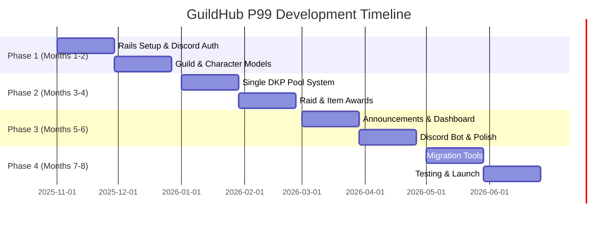

# Implementation Roadmap
## GuildHub - P99 EverQuest DKP System (Simplified)

**Version:** 2.0 (P99-Focused)
**Date:** October 19, 2025
**Duration:** 8 months (16 sprints of 2 weeks each)
**Team Size:** 1-2 developers (or solo with volunteer help)
**Scope:** Single DKP pool, P99 only, no calendar, no plugins/themes

> **📋 NOTE:** This document provides high-level sprint planning and milestones. For **detailed task breakdown** with story points, acceptance criteria, and time estimates for each task, see **[TASKS.md](TASKS.md)** which contains 170+ individual tasks across 14 epics.

---

## Table of Contents
1. [Overview](#overview)
2. [Phase 1: Foundation (Months 1-2)](#phase-1-foundation)
3. [Phase 2: Core DKP System (Months 3-4)](#phase-2-core-dkp-system)
4. [Phase 3: Content & Polish (Months 5-6)](#phase-3-content-polish)
5. [Phase 4: Migration & Launch (Months 7-8)](#phase-4-migration-launch)
6. [Definition of Done](#definition-of-done)

---

## Overview

### Project Timeline (Simplified P99 Focus)



### Delivery Milestones

| Milestone | Month | Date | Deliverables |
|-----------|-------|------|--------------|
| **M1: Foundation** | Month 2 | Dec 2025 | Rails 8 app, Discord OAuth, Guild/Character models |
| **M2: Core DKP** | Month 4 | Feb 2026 | DKP tracking, Raids, Item awards, Standings |
| **M3: Polish** | Month 6 | Apr 2026 | Announcements, Dashboard, Discord bot, Analytics |
| **M4: Launch** | Month 8 | Jun 2026 | Migration tools, Documentation, 2-3 pilot guilds |

---

## Phase 1: Foundation (Sprints 1-4, Months 1-2)

> **Note:** Sprints 9-24 from the original 12-month plan have been removed. This is now an 8-month plan (16 sprints). See **[TASKS.md](TASKS.md)** for the complete P99-focused implementation breakdown.

### Sprint 1: Project Setup & Foundation
**Duration:** Nov 1 - Nov 14, 2025
**Theme:** Get the Rails foundation in place

#### Stories

**Epic: Project Initialization**

- [ ] **GUILD-1**: Initialize Rails 8.0 application with PostgreSQL
  - Points: 2
  - Create new Rails app: `rails new guildhub --database=postgresql --css=tailwind`
  - Set up version control (Git)
  - Configure database.yml
  - Verify Rails server starts

- [ ] **GUILD-2**: Set up development environment with Docker
  - Points: 3
  - Create Dockerfile and docker-compose.yml
  - Configure PostgreSQL and Redis containers
  - Document setup in README
  - Test container orchestration

- [ ] **GUILD-3**: Configure essential gems (Devise, Pundit, RSpec)
  - Points: 3
  - Add Gemfile dependencies
  - Run `bundle install`
  - Generate Devise install
  - Generate RSpec install
  - Set up FactoryBot and Faker

- [ ] **GUILD-4**: Set up CI/CD with GitHub Actions
  - Points: 2
  - Create `.github/workflows/ci.yml`
  - Configure RSpec test runner
  - Configure Rubocop linter
  - Configure Brakeman security scanner

**Epic: Database Schema Planning**

- [ ] **GUILD-5**: Design initial database schema (ERD)
  - Points: 5
  - Create ERD using rails-erd gem
  - Document core tables and relationships
  - Review with team
  - Prepare for Sprint 2 migrations

**Sprint 1 Total Points:** 15

---

### Sprint 2: User Authentication & Authorization
**Duration:** Nov 3 - Nov 16, 2025
**Theme:** Users can register, login, and have permissions

#### Stories

**Epic: User Management**

- [ ] **GUILD-10**: Implement User model with Devise
  - Points: 3
  - Generate User model
  - Configure Devise modules (database_authenticatable, registerable, etc.)
  - Add username field
  - Add preferences (JSONB)

- [ ] **GUILD-11**: Create user registration flow
  - Points: 5
  - Registration form with validation
  - Email confirmation
  - Success/error handling
  - Tests (model + request specs)

- [ ] **GUILD-12**: Create login/logout functionality
  - Points: 3
  - Login form
  - Session management
  - Remember me functionality
  - Password reset flow

- [ ] **GUILD-13**: Implement authorization with Pundit
  - Points: 5
  - Install Pundit
  - Create base ApplicationPolicy
  - Add policy enforcement to controllers
  - Tests for policies

- [ ] **GUILD-14**: Create user profile page
  - Points: 3
  - Profile view (show)
  - Edit profile form
  - Avatar upload with ActiveStorage
  - Timezone and locale selection

**Sprint 2 Total Points:** 19

---

### Sprint 3: Guild & Character Models
**Duration:** Nov 17 - Nov 30, 2025
**Theme:** Core domain models for guilds and characters

#### Stories

**Epic: Guild Management**

- [ ] **GUILD-20**: Create Guild model and CRUD
  - Points: 5
  - Guild migration and model
  - Associations (has_many characters, ranks, etc.)
  - CRUD controllers and views
  - Policy for guild management
  - Tests

- [ ] **GUILD-21**: Implement guild membership system
  - Points: 3
  - GuildMembership join table
  - User can belong to multiple guilds
  - Guild switching functionality
  - Current guild in session

**Epic: Character/Member System**

- [ ] **GUILD-22**: Create Character model
  - Points: 5
  - Character migration with profile_data (JSONB)
  - Belongs to guild
  - Status enum (active, inactive, deleted)
  - Character creation form
  - Tests

- [ ] **GUILD-23**: Implement main/alt character relationships
  - Points: 5
  - Self-referential association
  - Set main character
  - Display alt characters on profile
  - Tests for relationship integrity

- [ ] **GUILD-24**: Create character list and detail pages
  - Points: 3
  - Character index with filtering
  - Character show page
  - Character edit/update
  - ViewComponent for character card

**Sprint 3 Total Points:** 21

---

### Sprint 4: Ranks & Permissions
**Duration:** Dec 1 - Dec 14, 2025
**Theme:** Guild hierarchy and permissions

#### Stories

**Epic: Rank System**

- [ ] **GUILD-30**: Create Rank model and management
  - Points: 5
  - Rank migration
  - CRUD for ranks
  - Position ordering (acts_as_list gem)
  - Default rank designation

- [ ] **GUILD-31**: Assign ranks to characters
  - Points: 3
  - Character belongs_to rank
  - Rank selection in character form
  - Display rank on character card
  - Rank-based styling/badges

- [ ] **GUILD-32**: Implement rank-based permissions
  - Points: 5
  - Permission model
  - Rank has_many permissions
  - Policy checks based on rank
  - Tests for permission hierarchy

**Epic: UI Foundation**

- [ ] **GUILD-33**: Create base layout and navigation
  - Points: 5
  - Application layout with Tailwind CSS
  - Top navigation bar
  - Sidebar for guild context
  - User menu dropdown
  - Responsive design

- [ ] **GUILD-34**: Dashboard homepage
  - Points: 3
  - Dashboard controller and view
  - Activity feed placeholder
  - Quick stats (members, raids, DKP)
  - Announcements section

**Sprint 4 Total Points:** 21

**Milestone M1: Foundation Complete** ✅

---

### Sprint 5: DKP Pools & Event Types
**Duration:** Dec 15 - Dec 28, 2025
**Theme:** DKP system foundation

#### Stories

**Epic: DKP Infrastructure**

- [ ] **GUILD-40**: Create DKP Pool model
  - Points: 3
  - DkpPool migration
  - CRUD interface
  - Multiple pools per guild
  - Pool settings (JSONB)

- [ ] **GUILD-41**: Create Event Type model
  - Points: 3
  - EventType migration
  - CRUD for event types
  - Default point values
  - Icon upload

- [ ] **GUILD-42**: Link DKP Pools to Event Types (many-to-many)
  - Points: 3
  - Join table migration
  - Association setup
  - UI for pool-event mapping
  - Tests

**Epic: Point Transaction System**

- [ ] **GUILD-43**: Create PointTransaction model
  - Points: 5
  - Migration with polymorphic transactionable
  - Transaction types enum (earned, spent, adjustment)
  - Associations to character and pool
  - Validation rules

- [ ] **GUILD-44**: Implement point balance calculation
  - Points: 5
  - Current points method on Character
  - Historical points query object
  - Efficient SQL for large datasets
  - Caching strategy

**Sprint 5 Total Points:** 19

---

### Sprint 6: Raid Management
**Duration:** Dec 29, 2025 - Jan 11, 2026
**Theme:** Core raid tracking

#### Stories

**Epic: Raid Creation**

- [ ] **GUILD-50**: Create Raid model
  - Points: 3
  - Raid migration
  - Belongs to guild, event_type, creator
  - Basic validations

- [ ] **GUILD-51**: Raid creation form with attendees
  - Points: 8
  - Multi-step form (or single complex form)
  - Event type selection
  - Date/time picker
  - Attendee selection (multi-select)
  - Point value override
  - Tests

- [ ] **GUILD-52**: Raid attendee tracking
  - Points: 3
  - RaidAttendee join model
  - Role field (tank, healer, DPS)
  - Attendee list display
  - Add/remove attendees after creation

- [ ] **GUILD-53**: Raid list and detail pages
  - Points: 5
  - Raid index with filters (date range, event type)
  - Raid show page with attendees
  - Edit raid
  - Delete raid (with confirmation)

**Sprint 6 Total Points:** 19

---

### Sprint 7: Item Awards & Point Allocation
**Duration:** Jan 12 - Jan 25, 2026
**Theme:** Loot distribution and automatic point calculation

#### Stories

**Epic: Item Management**

- [ ] **GUILD-60**: Create Item model
  - Points: 3
  - Item migration
  - Belongs to raid, character
  - Game item ID field
  - Cost field

- [ ] **GUILD-61**: Item award interface
  - Points: 5
  - Award item form (within raid context)
  - Character selection
  - Cost input
  - Validation (sufficient DKP)
  - Tests

- [ ] **GUILD-62**: Auto-deduct points on item award
  - Points: 5
  - Service object for item award
  - Create PointTransaction (spent)
  - Update character balance
  - Transaction rollback on error

**Epic: Point Calculation**

- [ ] **GUILD-63**: Auto-award attendance points after raid
  - Points: 5
  - Service object for point calculation
  - Create PointTransaction for each attendee
  - Support point overrides
  - Background job (Sidekiq)

- [ ] **GUILD-64**: DKP standings page
  - Points: 3
  - Standings index
  - Filter by DKP pool
  - Sort by current/earned/spent
  - Export to CSV

**Sprint 7 Total Points:** 21

---

### Sprint 8: Manual Adjustments & Audit
**Duration:** Jan 26 - Feb 8, 2026
**Theme:** Manual DKP management and audit trails

#### Stories

**Epic: Manual Adjustments**

- [ ] **GUILD-70**: Point adjustment interface
  - Points: 5
  - Adjustment form
  - Reason required
  - Mass adjustment (multiple characters)
  - Preview before apply

- [ ] **GUILD-71**: Adjustment history and audit
  - Points: 3
  - PaperTrail integration
  - Version history display
  - Who made adjustment
  - Rollback capability (admin only)

**Epic: Testing & Polish**

- [ ] **GUILD-72**: Comprehensive testing of DKP flow
  - Points: 5
  - Integration tests for full DKP lifecycle
  - Edge cases (negative points, etc.)
  - Performance tests
  - Fix bugs discovered

- [ ] **GUILD-73**: UI/UX improvements based on feedback
  - Points: 5
  - Collect feedback from test users
  - Improve form validations
  - Better error messages
  - Loading states

- [ ] **GUILD-74**: Documentation for MVP
  - Points: 3
  - User guide for core features
  - Admin guide
  - API documentation (if exposing API)

**Sprint 8 Total Points:** 21

**Milestone M2: MVP Complete** ✅

---

## ⚠️ IMPORTANT: Sprint Details Beyond This Point Are From Original 12-Month Plan

> **The detailed sprint breakdown below (Sprints 9-24) is from the original multi-game, 12-month plan and includes features that have been removed in the P99-focused version:**
> - ❌ Calendar & Event Signups (Sprints 9-10) - Removed (P99 guilds use Discord)
> - ❌ Full CMS (Sprints 11-12) - Simplified to basic announcements
> - ❌ Portal System (Sprint 13) - Simplified dashboard only
> - ❌ Multiple DKP Pools - Consolidated to single pool
>
> **For the current P99-focused 8-month implementation plan (16 sprints), see:**
> - **[TASKS.md](TASKS.md)** - Comprehensive task breakdown with 166 story points across 14 epics
> - Phases 2-4: Core DKP → Content & Polish → Migration & Launch
> - Timeline: November 2025 - June 2026
>
> The content below is retained for historical reference only.

---

## Phase 2: Core Features (Sprints 9-16) - ⚠️ DEPRECATED

### Sprint 9: Calendar Foundation
**Duration:** Feb 9 - Feb 22, 2026
**Theme:** Calendar and event scheduling

#### Stories

**Epic: Calendar System**

- [ ] **GUILD-80**: Create Calendar model
  - Points: 3
  - Calendar migration
  - Multiple calendars per guild
  - Color coding
  - Permissions (public/private)

- [ ] **GUILD-81**: Create CalendarEvent model
  - Points: 5
  - Event migration
  - Start/end times (timestamp)
  - All-day flag
  - Belongs to calendar
  - Recurring events (ice_cube gem setup)

- [ ] **GUILD-82**: Integrate FullCalendar.js
  - Points: 8
  - Install FullCalendar via yarn
  - Stimulus controller for calendar
  - Display events from database
  - AJAX event creation
  - Drag-and-drop (basic)

**Sprint 9 Total Points:** 16

---

### Sprint 10: Event Signups
**Duration:** Feb 23 - Mar 8, 2026
**Theme:** Event RSVP system

#### Stories

**Epic: Signup System**

- [ ] **GUILD-90**: Create EventSignup model
  - Points: 3
  - Signup migration
  - Belongs to event and character
  - Status enum (confirmed, tentative, declined)
  - Role field

- [ ] **GUILD-91**: Signup interface
  - Points: 8
  - Signup form on event detail
  - Select character and role
  - Status selection
  - Notes field
  - Real-time update with Turbo

- [ ] **GUILD-92**: Signup management for organizers
  - Points: 5
  - View all signups
  - Approve/decline signups
  - Move to confirmed
  - Assign raid groups

- [ ] **GUILD-93**: Notifications for signups
  - Points: 5
  - Email notification on signup
  - Email notification on status change
  - In-app notification
  - Notification preferences

**Sprint 10 Total Points:** 21

---

### Sprint 11: Articles & CMS
**Duration:** Mar 9 - Mar 22, 2026
**Theme:** Content management

#### Stories

**Epic: Article System**

- [ ] **GUILD-100**: Create Article model with ActionText
  - Points: 5
  - Article migration
  - ActionText integration for rich content
  - Author association (User)
  - Published/draft status
  - FriendlyId for SEO URLs

- [ ] **GUILD-101**: Article CRUD interface
  - Points: 5
  - New article form with Trix editor
  - Edit article
  - Publish/unpublish
  - Delete article
  - Tests

- [ ] **GUILD-102**: Article categories
  - Points: 3
  - Category model
  - Nested categories (ancestry gem)
  - Category management
  - Filter articles by category

- [ ] **GUILD-103**: Article list and detail pages
  - Points: 5
  - Article index (public)
  - Featured articles
  - Pagination (Kaminari)
  - Article show page
  - Social sharing buttons

**Sprint 11 Total Points:** 18

---

### Sprint 12: Comments & Tagging
**Duration:** Mar 23 - Apr 5, 2026
**Theme:** Community engagement

#### Stories

**Epic: Comments**

- [ ] **GUILD-110**: Implement commenting system
  - Points: 5
  - Comment model (polymorphic)
  - Nested/threaded comments
  - Comment form (AJAX)
  - Comment moderation

- [ ] **GUILD-111**: Comment notifications
  - Points: 3
  - Notify article author
  - Notify on reply
  - @ mentions

**Epic: Tagging**

- [ ] **GUILD-112**: Article tagging
  - Points: 3
  - Acts_as_taggable_on integration
  - Tag input (Tom Select.js)
  - Tag cloud
  - Filter by tag

**Epic: Search**

- [ ] **GUILD-113**: Global search
  - Points: 8
  - PgSearch integration
  - Search articles, characters, raids
  - Search results page
  - Highlighting

**Sprint 12 Total Points:** 19

---

### Sprint 13: Portal System
**Duration:** Apr 6 - Apr 19, 2026
**Theme:** Customizable homepage

#### Stories

**Epic: Portal Widgets**

- [ ] **GUILD-120**: Portal module framework
  - Points: 8
  - PortalModule model
  - Widget registry
  - Positioning system
  - Settings (JSONB)

- [ ] **GUILD-121**: Create default widgets
  - Points: 8
  - Recent raids widget
  - DKP standings widget
  - Recent articles widget
  - Upcoming events widget
  - Online members widget

- [ ] **GUILD-122**: Drag-and-drop layout builder
  - Points: 5
  - Stimulus controller for drag-drop
  - Save layout via AJAX
  - Admin-only editor
  - Preview mode

**Sprint 13 Total Points:** 21

---

### Sprint 14: Notifications & Real-Time
**Duration:** Apr 20 - May 3, 2026
**Theme:** Real-time features

#### Stories

**Epic: Notification System**

- [ ] **GUILD-130**: Notification model and delivery
  - Points: 5
  - Notification model
  - Delivery via ActionCable
  - Email delivery (background job)
  - Mark as read

- [ ] **GUILD-131**: Notification preferences
  - Points: 3
  - User notification settings
  - Email vs in-app preferences
  - Frequency settings (instant, digest)

**Epic: ActionCable Integration**

- [ ] **GUILD-132**: Real-time raid updates
  - Points: 5
  - Broadcast raid changes
  - Live attendee list
  - Item award notifications

- [ ] **GUILD-133**: Live chat (optional)
  - Points: 8
  - Chat room per guild
  - Message broadcast
  - Message persistence
  - Presence indicator

**Sprint 14 Total Points:** 21

---

### Sprint 15: File Management & Media
**Duration:** May 4 - May 17, 2026
**Theme:** File uploads and media

#### Stories

**Epic: File Uploads**

- [ ] **GUILD-140**: Configure ActiveStorage with S3
  - Points: 3
  - S3 bucket setup
  - ActiveStorage config
  - Image variants
  - Direct upload

- [ ] **GUILD-141**: Avatar uploads
  - Points: 3
  - User avatar
  - Character portrait
  - Image cropping (optional)

- [ ] **GUILD-142**: Article image uploads
  - Points: 3
  - Embed images in articles
  - Gallery attachments
  - Image optimization

**Epic: Media Library**

- [ ] **GUILD-143**: Media library interface
  - Points: 8
  - Browse uploaded files
  - Upload new files
  - Delete files
  - Search files

- [ ] **GUILD-144**: Raid screenshots
  - Points: 3
  - Attach screenshots to raids
  - Gallery view
  - Lightbox

**Sprint 15 Total Points:** 20

---

### Sprint 16: Admin Panel & Settings
**Duration:** May 18 - May 31, 2026
**Theme:** Administrative tools

#### Stories

**Epic: Admin Interface**

- [ ] **GUILD-150**: Admin dashboard
  - Points: 5
  - Admin namespace
  - Stats overview
  - Recent activity
  - User management

- [ ] **GUILD-151**: Guild settings management
  - Points: 5
  - Settings model (rails-settings-cached)
  - Settings UI
  - General, DKP, Calendar tabs
  - Save/reset

- [ ] **GUILD-152**: Backup and restore
  - Points: 5
  - Database backup rake task
  - Download backup
  - Restore from backup (with caution)

**Epic: Moderation Tools**

- [ ] **GUILD-153**: Content moderation
  - Points: 5
  - Flagging system
  - Moderation queue
  - Approve/reject actions
  - Ban users

**Sprint 16 Total Points:** 20

**Milestone M3: Feature Complete** ✅

---

## Phase 3: Advanced Features (Sprints 17-24)

### Sprint 17-18: Data Migration Tools
**Duration:** Jun 1 - Jun 28, 2026
**Theme:** EQdkpPlus → GuildHub migration

#### Stories

**Epic: Migration Scripts**

- [ ] **GUILD-160**: MySQL connection and export
  - Points: 5
  - Connect to EQdkpPlus database
  - Export tables to JSON
  - Validation and cleanup

- [ ] **GUILD-161**: User and character migration
  - Points: 8
  - Transform EQdkpPlus users
  - Password migration strategy
  - Character import
  - Main/alt linking

- [ ] **GUILD-162**: DKP data migration
  - Points: 8
  - Import raids
  - Import items
  - Import points
  - Verify balances

- [ ] **GUILD-163**: Content migration
  - Points: 5
  - Import articles
  - Import comments
  - File uploads

- [ ] **GUILD-164**: Migration testing and docs
  - Points: 8
  - Test on real EQdkpPlus data
  - Document migration process
  - Create runbook
  - Support pilot migrations

**Sprint 17-18 Total Points:** 34

---

### Sprint 19: API Development
**Duration:** Jun 29 - Jul 12, 2026
**Theme:** RESTful API

#### Stories

**Epic: API Foundation**

- [ ] **GUILD-170**: API authentication (JWT)
  - Points: 5
  - JWT generation
  - API token management
  - Rate limiting

- [ ] **GUILD-171**: API endpoints for core resources
  - Points: 13
  - Characters API
  - Raids API
  - Items API
  - DKP standings API
  - Events API
  - Serializers (jsonapi-serializer)

- [ ] **GUILD-172**: API documentation
  - Points: 3
  - Swagger/OpenAPI spec
  - Generated API docs
  - Example requests

**Sprint 19 Total Points:** 21

---

### Sprint 20: Integrations
**Duration:** Jul 13 - Jul 26, 2026
**Theme:** External service integrations

#### Stories

**Epic: Discord Integration**

- [ ] **GUILD-180**: Discord OAuth
  - Points: 5
  - OmniAuth Discord provider
  - Link Discord account
  - Discord avatar sync

- [ ] **GUILD-181**: Discord bot
  - Points: 13
  - Bot setup
  - Slash commands
  - Event announcements
  - DKP queries

**Epic: Game APIs**

- [ ] **GUILD-182**: WoW Armory integration
  - Points: 8
  - Character import
  - Item lookup
  - Achievement sync

**Sprint 20 Total Points:** 26

---

### Sprint 21-22: Performance & Polish
**Duration:** Jul 27 - Aug 23, 2026
**Theme:** Optimization and refinement

#### Stories

**Epic: Performance**

- [ ] **GUILD-190**: Database optimization
  - Points: 5
  - Add missing indexes
  - Optimize slow queries
  - Connection pooling

- [ ] **GUILD-191**: Caching strategy
  - Points: 5
  - Fragment caching
  - Russian doll caching
  - HTTP caching headers

- [ ] **GUILD-192**: Load testing
  - Points: 5
  - Set up load tests (k6)
  - Identify bottlenecks
  - Optimize

**Epic: UI/UX Polish**

- [ ] **GUILD-193**: Design refinement
  - Points: 8
  - Consistent styling
  - Improved forms
  - Better error states
  - Loading states

- [ ] **GUILD-194**: Mobile optimization
  - Points: 8
  - Responsive fixes
  - Touch optimization
  - PWA manifest

- [ ] **GUILD-195**: Accessibility
  - Points: 5
  - ARIA labels
  - Keyboard navigation
  - Screen reader support

**Sprint 21-22 Total Points:** 36

---

### Sprint 23: Beta Testing
**Duration:** Aug 24 - Sep 6, 2026
**Theme:** Beta program and bug fixes

#### Stories

**Epic: Beta Program**

- [ ] **GUILD-200**: Beta signup and onboarding
  - Points: 5
  - Beta signup form
  - Onboarding flow
  - Tutorial/walkthrough

- [ ] **GUILD-201**: Bug triage and fixes
  - Points: 13
  - Fix reported bugs
  - Prioritization
  - Regression testing

- [ ] **GUILD-202**: Performance tuning
  - Points: 5
  - Address bottlenecks
  - Optimize database
  - CDN configuration

- [ ] **GUILD-203**: Security audit
  - Points: 5
  - Run Brakeman
  - Penetration testing
  - Fix vulnerabilities

**Sprint 23 Total Points:** 28

---

### Sprint 24: Launch
**Duration:** Sep 7 - Sep 20, 2026
**Theme:** Production launch

#### Stories

**Epic: Launch Preparation**

- [ ] **GUILD-210**: Production infrastructure
  - Points: 5
  - Set up production servers
  - Database backups
  - Monitoring (New Relic/Skylight)
  - Error tracking (Sentry)

- [ ] **GUILD-211**: Launch marketing
  - Points: 8
  - Landing page
  - Launch announcement
  - Social media campaign
  - Press release

- [ ] **GUILD-212**: Documentation finalization
  - Points: 5
  - User docs
  - Admin docs
  - Developer docs
  - Video tutorials

- [ ] **GUILD-213**: Launch day support
  - Points: 5
  - Support channels ready
  - On-call rotation
  - Monitor metrics
  - Rapid response to issues

**Sprint 24 Total Points:** 23

**Milestone M5: Public Launch** ✅ 🎉

---

## Sprint Templates

### Sprint Planning Template

```markdown
## Sprint X: [Theme]
**Duration:** [Start Date] - [End Date]
**Goal:** [High-level sprint goal]

### Team Capacity
- Developer 1: 40 hours (20 points)
- Developer 2: 40 hours (20 points)
- **Total Capacity:** 40 points

### Sprint Backlog
| Story ID | Title | Points | Assignee | Status |
|----------|-------|--------|----------|--------|
| GUILD-XX | ... | 5 | Dev 1 | To Do |

### Sprint Goals
1. Complete Feature X
2. Begin Feature Y
3. Fix critical bugs

### Definition of Ready
- [ ] Story has acceptance criteria
- [ ] Story has been estimated
- [ ] Dependencies identified
- [ ] Design mockups available (if UI work)

### Sprint Risks
- Risk 1: Description and mitigation
- Risk 2: ...
```

### Daily Standup Template

```markdown
## Daily Standup - [Date]

### Developer 1
**Yesterday:** Completed GUILD-XX, started GUILD-YY
**Today:** Finish GUILD-YY, start GUILD-ZZ
**Blockers:** None

### Developer 2
**Yesterday:** ...
**Today:** ...
**Blockers:** ...
```

---

## Definition of Done

### Story-Level DoD

A story is considered "Done" when:

- [ ] Code is written and pushed to feature branch
- [ ] All acceptance criteria met
- [ ] Unit tests written (>90% coverage for new code)
- [ ] Integration tests written (for critical paths)
- [ ] Code reviewed and approved by peer
- [ ] Merged to `main` branch
- [ ] Deployed to staging environment
- [ ] Manual QA passed
- [ ] Documentation updated (if needed)
- [ ] No critical bugs or regressions

### Sprint-Level DoD

A sprint is considered "Done" when:

- [ ] All committed stories meet story-level DoD
- [ ] Sprint demo conducted
- [ ] Retrospective completed
- [ ] Deployed to production (or staging)
- [ ] Metrics reviewed
- [ ] Next sprint planned

### Release-Level DoD

A release is considered "Done" when:

- [ ] All features complete and tested
- [ ] Security audit passed
- [ ] Performance benchmarks met
- [ ] Documentation complete
- [ ] Migration guide ready
- [ ] Support channels prepared
- [ ] Deployed to production
- [ ] Announcement published

---

## Velocity Tracking

### Initial Velocity Estimate

Based on a 2-person team working full-time:
- **Week 1-2 (Sprint 1):** 15-20 points (ramping up)
- **Week 3-4 (Sprint 2):** 18-22 points
- **Steady state:** 20-25 points per sprint

### Velocity Adjustment

- Track actual velocity each sprint
- Adjust future planning based on 3-sprint rolling average
- Account for holidays, PTO, etc.

---

## Technology Stack Decisions by Sprint

| Sprint | Technology Decisions |
|--------|---------------------|
| 1 | Rails 8.0, PostgreSQL, Tailwind CSS |
| 2 | Devise, Pundit |
| 3 | ActiveStorage, JSONB for flexible data |
| 5 | Sidekiq for background jobs |
| 6 | Stimulus.js for JavaScript |
| 9 | FullCalendar.js |
| 11 | ActionText/Trix for rich text |
| 13 | ViewComponent for reusable UI |
| 14 | ActionCable for real-time |
| 17 | Migration scripts (Ruby) |
| 19 | JWT, jsonapi-serializer |
| 20 | Discord API, WoW API |

---

**Document Control**

| Version | Date | Author | Changes |
|---------|------|--------|---------|
| 1.0 | 2025-10-19 | Product Team | Initial roadmap |
