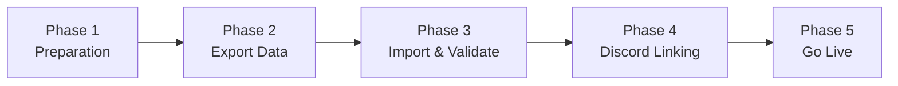

# Migration Strategy
## EQdkpPlus (PHP) → GuildHub (Rails 8) for Project 1999 Guilds

**Document Version:** 2.0 (P99-Focused)
**Date:** October 19, 2025
**Status:** Planning Phase
**Target:** P99 EverQuest guilds migrating from EQdkpPlus

---

## Table of Contents
1. [Overview](#overview)
2. [Migration Approach](#migration-approach)
3. [Data Migration](#data-migration)
4. [User Migration (Discord Linking)](#user-migration-discord-linking)
5. [Risk Mitigation](#risk-mitigation)
6. [Testing Strategy](#testing-strategy)

---

## 1. Overview

### 1.1 Migration Scope

This document outlines the strategy for migrating Project 1999 guilds from EQdkpPlus to GuildHub.

**Migration Components:**
- ✅ **Database**: MySQL (EQdkpPlus) → PostgreSQL 16+ (GuildHub)
- ✅ **DKP Data**: Multi-pool consolidation → Single DKP pool
- ✅ **Characters**: Generic game data → EverQuest-specific (classes/races)
- ✅ **Raids**: Event tracking with attendance
- ✅ **Items**: Loot awards and DKP costs
- ✅ **Users**: Traditional accounts → Discord OAuth linking
- ⬜ **Plugins**: Not supported (core DKP features only)
- ⬜ **Themes**: Not supported (Tailwind CSS styling)
- ⬜ **Calendar**: Not migrated (not supported)

### 1.2 Goals

1. **Data Integrity**: 100% DKP history preservation
2. **Minimal Disruption**: Simple 2-hour migration window
3. **Discord Integration**: Easy Discord account linking
4. **Validation**: DKP balance verification
5. **Documentation**: Step-by-step migration guide

---

## 2. Migration Approach

### 2.1 Simplified Migration Phases (P99 Guilds)



#### Phase 1: Preparation (1-2 days)
- Create GuildHub guild account
- Configure DKP settings (single pool name, rules)
- Create seed data (P99 raid types: PoF, PoH, etc.)
- Review EQdkpPlus data for quality issues
- Download EQdkpPlus MySQL database dump

#### Phase 2: Data Export (1 hour)
- Export EQdkpPlus MySQL database
- Verify export completeness
- Note DKP pool configuration (if multi-pool, choose primary)
- Document any custom event types

#### Phase 3: Import & Validate (1-2 hours)
- Run GuildHub import script (lib/importers/eqdkp_importer.rb)
- Script auto-consolidates multi-pools to single pool
- Map EQdkpPlus classes/races to EQ standard values
- Verify character import (names, classes, races, levels)
- Verify DKP balances match EQdkpPlus
- Verify raid history import
- Verify item award history

#### Phase 4: Discord Linking (1-2 days)
- Guild members log in with Discord OAuth
- Members link their Discord account to imported characters
- Officers verify character ownership
- Primary character designation

#### Phase 5: Go Live (1 hour)
- Final validation of DKP standings
- Announce migration complete to guild
- Archive EQdkpPlus installation (read-only)
- Begin using GuildHub for new raids
- Monitor for issues

### 2.2 Migration Tool (Rails Console Script)

```ruby
# lib/importers/eqdkp_importer.rb
# Usage: rails runner lib/importers/eqdkp_importer.rb /path/to/eqdkp_dump.sql

class EqdkpImporter
  def initialize(guild_id, mysql_dump_path)
    @guild = Guild.find(guild_id)
    @mysql_dump = mysql_dump_path
    @stats = {
      characters: 0,
      raids: 0,
      items: 0,
      errors: []
    }
  end

  def import!
    ActiveRecord::Base.transaction do
      load_mysql_dump
      import_characters
      import_event_types
      import_raids
      import_raid_attendance
      import_item_awards
      import_adjustments
      validate_dkp_balances
      print_summary
    end
  rescue => e
    log_error("Import failed: #{e.message}")
    raise ActiveRecord::Rollback
  end

  private

  def import_characters
    # Map EQdkpPlus characters to GuildHub
    # Handle class/race mapping
    # Consolidate multi-pool data to single pool
  end

  def consolidate_dkp_pools
    # If EQdkpPlus has multiple pools, sum them
    # Or let guild choose primary pool to import
  end

  def validate_dkp_balances
    # Compare EQdkpPlus balances to GuildHub calculated balances
    # Raise error if mismatch
  end
end
```

---

## 3. Data Migration

### 3.1 Database Schema Mapping

#### 3.1.1 Core Tables Mapping

| EQdkpPlus Table | GuildHub Model | Transformation Notes |
|-----------------|----------------|----------------------|
| `__users` | `User` | Map to Devise schema, rehash passwords |
| `__members` | `Character` | Rename to Character, update relationships |
| `__member_ranks` | `Rank` | Direct mapping with STI for types |
| `__raids` | `Raid` | Add polymorphic associations |
| `__items` | `Item` | Map to Item model with audit trail |
| `__events` | `EventType` | Rename for clarity |
| `__adjustments` | `PointAdjustment` | Add PaperTrail versioning |
| `__multidkp` | `DkpPool` | Rename to DkpPool |
| `__calendar_events` | `CalendarEvent` | Map to calendar system |
| `__articles` | `Article` | Map to ActionText for content |
| `__comments` | `Comment` | Add polymorphic commentable |
| `__sessions` | Rails sessions | Migrate active sessions |
| `__logs` | `AuditLog` | Map to PaperTrail versions |

#### 3.1.2 Field Transformations

```ruby
# Example transformation: EQdkpPlus user → Rails User

class UserTransformer
  def transform(eqdkp_user)
    {
      # Direct mappings
      email: eqdkp_user['user_email'],
      username: eqdkp_user['username'],
      created_at: Time.at(eqdkp_user['user_registered']),
      last_sign_in_at: Time.at(eqdkp_user['user_lastvisit']),

      # Transformations
      encrypted_password: migrate_password(eqdkp_user['user_password']),
      time_zone: eqdkp_user['user_timezone'] || 'UTC',
      locale: map_language(eqdkp_user['user_lang']),

      # JSON/serialized data
      preferences: deserialize_php(eqdkp_user['plugin_settings']),
      privacy_settings: deserialize_php(eqdkp_user['privacy_settings']),

      # Confirmable (Devise)
      confirmed_at: eqdkp_user['user_email_confirmed'] == 1 ? Time.current : nil,

      # Trackable (Devise)
      sign_in_count: calculate_sign_in_count(eqdkp_user),
      current_sign_in_ip: eqdkp_user['last_ip'] # if tracked
    }
  end

  private

  def migrate_password(php_hash)
    # Users will need to reset passwords initially
    # or implement PHP password verification temporarily
    Devise.friendly_token[0, 20]
  end

  def deserialize_php(data)
    return {} if data.blank?

    # Use php_serialization gem
    PhpSerialization.load(data)
  rescue
    {}
  end

  def map_language(lang_code)
    {
      'english' => 'en',
      'german' => 'de',
      'french' => 'fr'
      # ... more mappings
    }[lang_code] || 'en'
  end
end
```

#### 3.1.3 Relationship Migrations

```ruby
# Member → Character with User association

class MemberTransformer
  def transform_with_relationships(eqdkp_member, user_mappings)
    character = Character.create!(
      name: eqdkp_member['member_name'],
      status: map_status(eqdkp_member['member_status']),
      rank_id: map_rank(eqdkp_member['member_rank_id']),
      main_character_id: map_main_id(eqdkp_member['member_main_id']),
      created_at: Time.at(eqdkp_member['member_creation_date']),
      profile_data: deserialize_profile(eqdkp_member['profiledata']),
      notes: eqdkp_member['notes']
    )

    # Link to User via member_user table
    user_links = lookup_user_links(eqdkp_member['member_id'])
    user_links.each do |link|
      user_id = user_mappings[link['user_id']]
      CharacterUser.create!(
        character: character,
        user_id: user_id,
        primary: determine_primary(link)
      )
    end

    character
  end
end
```

### 3.2 Data Volume Handling

#### 3.2.1 Batch Processing

```ruby
# Process large datasets in batches

class BatchMigrator
  BATCH_SIZE = 1000

  def migrate_table(source_table, transformer_class)
    total = count_records(source_table)
    progress = 0

    source_table.find_in_batches(batch_size: BATCH_SIZE) do |batch|
      ActiveRecord::Base.transaction do
        batch.each do |record|
          transformer = transformer_class.new(record)
          transformer.migrate!
        end
      end

      progress += batch.size
      log_progress(progress, total)
    end
  end
end
```

#### 3.2.2 Parallel Processing

```ruby
# Use Sidekiq for parallel migration

class ParallelMigrationJob < ApplicationJob
  queue_as :migration

  def perform(table_name, batch_number)
    offset = batch_number * BATCH_SIZE

    records = fetch_batch(table_name, offset, BATCH_SIZE)
    migrate_batch(records)

    MigrationProgress.increment(table_name, records.count)
  end
end
```

### 3.3 File Migration

#### 3.3.1 Uploaded Files

```ruby
# Migrate uploads to ActiveStorage

class FileMigrator
  def migrate_uploads
    # EQdkpPlus stores files in /data/uploads/

    Dir.glob("/old/eqdkp/data/uploads/**/*").each do |file_path|
      next unless File.file?(file_path)

      # Determine owner from database
      owner = find_file_owner(file_path)

      # Attach to ActiveStorage
      owner.files.attach(
        io: File.open(file_path),
        filename: File.basename(file_path),
        content_type: Marcel::MimeType.for(Pathname.new(file_path))
      )
    end
  end

  def migrate_avatars
    User.find_each do |user|
      old_avatar_path = "/old/eqdkp/images/avatars/#{user.legacy_avatar}"
      next unless File.exist?(old_avatar_path)

      user.avatar.attach(
        io: File.open(old_avatar_path),
        filename: File.basename(old_avatar_path)
      )
    end
  end
end
```

### 3.4 Special Cases

#### 3.4.1 Serialized PHP Data

```ruby
# Many EQdkpPlus fields store PHP serialized data
# Use php_serialization gem

class PhpDataMigrator
  def migrate_serialized_field(php_data, target_attribute)
    return {} if php_data.blank?

    begin
      data = PhpSerialization.load(php_data)
      transform_to_json(data)
    rescue PhpSerialization::UnserializeError => e
      Rails.logger.error("Failed to unserialize: #{e.message}")
      {}
    end
  end

  private

  def transform_to_json(php_data)
    # Convert PHP arrays/objects to Ruby hashes
    case php_data
    when Hash
      php_data.transform_values { |v| transform_to_json(v) }
    when Array
      php_data.map { |v| transform_to_json(v) }
    else
      php_data
    end
  end
end
```

#### 3.4.2 Timestamps

```ruby
# EQdkpPlus uses UNIX timestamps (int)
# Rails uses datetime

def convert_timestamp(unix_timestamp)
  return nil if unix_timestamp.nil? || unix_timestamp.zero?
  Time.at(unix_timestamp).in_time_zone
end
```

#### 3.4.3 Password Migration

**Option 1: Force Password Reset**
```ruby
# Safest option: force all users to reset passwords
User.update_all(
  encrypted_password: Devise.friendly_token[0, 20],
  reset_password_sent_at: Time.current
)

# Send password reset emails
User.find_each do |user|
  user.send_reset_password_instructions
end
```

**Option 2: Dual Hash Verification (Temporary)**
```ruby
# Support both bcrypt and legacy PHP hashes temporarily

class User < ApplicationRecord
  def valid_password?(password)
    if legacy_password_hash.present?
      # Verify against PHP hash
      if verify_php_password(password, legacy_password_hash)
        # Migrate to bcrypt
        self.password = password
        self.legacy_password_hash = nil
        save!
        return true
      end
    end

    # Standard Devise verification
    super
  end

  private

  def verify_php_password(password, php_hash)
    # Use bcrypt gem if EQdkpPlus used bcrypt
    # Or implement PHP password_verify equivalent
    BCrypt::Password.new(php_hash) == password
  rescue
    false
  end
end
```

---

## 4. Code Migration Strategy

### 4.1 Feature Mapping

| EQdkpPlus Feature | Rails Implementation | Gem/Library |
|-------------------|---------------------|-------------|
| User Auth | Devise | devise |
| Permissions | Pundit/CanCanCan | pundit |
| File Uploads | ActiveStorage | built-in |
| Rich Text | ActionText | built-in |
| Background Jobs | Sidekiq | sidekiq |
| Caching | Rails cache + Redis | redis-rails |
| Search | PgSearch | pg_search |
| Pagination | Kaminari/Pagy | kaminari |
| State Machine | AASM | aasm |
| Audit Trail | PaperTrail | paper_trail |
| Tagging | ActsAsTaggable | acts-as-taggable-on |
| Comments | Commontator | commontator |
| Scheduling | Whenever | whenever |
| API | Rails API mode | built-in |
| Testing | RSpec | rspec-rails |

### 4.2 Plugin Migration

```ruby
# EQdkpPlus plugins → Rails Engines

# Old PHP plugin structure:
# /plugins/myplugin/
#   myplugin_plugin.class.php
#   install.sql
#   language/
#   templates/

# New Rails Engine structure:
# /engines/myplugin/
#   app/
#     models/
#     controllers/
#     views/
#   config/routes.rb
#   db/migrate/
#   lib/myplugin/engine.rb

# Engine definition
module Myplugin
  class Engine < ::Rails::Engine
    isolate_namespace Myplugin

    initializer "myplugin.assets" do |app|
      app.config.assets.paths << root.join("app/assets")
    end

    # Register hooks
    config.to_prepare do
      # Hook into GuildHub events
    end
  end
end
```

### 4.3 Template Migration

```erb
<!-- EQdkpPlus Template (Smarty-like) -->
{USERNAME}
<!-- IF condition -->Content<!-- ENDIF -->
<!-- BEGIN loop -->
  {loop.ITEM}
<!-- END loop -->

<!-- GuildHub Template (ERB) -->
<%= current_user.username %>
<% if condition %>Content<% end %>
<% @items.each do |item| %>
  <%= item.name %>
<% end %>
```

Better: Use ViewComponent for reusable components

```ruby
# app/components/member_card_component.rb
class MemberCardComponent < ViewComponent::Base
  def initialize(member:)
    @member = member
  end
end

# app/components/member_card_component.html.erb
<div class="member-card">
  <h3><%= @member.name %></h3>
  <p>Rank: <%= @member.rank.name %></p>
  <p>DKP: <%= @member.current_dkp %></p>
</div>

# Usage in view
<%= render MemberCardComponent.new(member: @member) %>
```

---

## 5. User Migration

### 5.1 Communication Plan

#### Pre-Migration (4 weeks before)
- **Week -4**: Announce migration plans
- **Week -3**: Share migration timeline
- **Week -2**: Provide training materials
- **Week -1**: Final reminder and support channels

#### During Migration
- Status page with real-time updates
- Discord/Slack channel for support
- Email updates at key milestones

#### Post-Migration (4 weeks after)
- **Week +1**: Intensive support period
- **Week +2**: Collect feedback
- **Week +3**: Address common issues
- **Week +4**: Post-mortem and lessons learned

### 5.2 Training Materials

1. **Video Tutorials**
   - "Your First Login to GuildHub"
   - "Creating a Raid in GuildHub"
   - "Managing DKP"
   - "Event Signups"

2. **Documentation**
   - Side-by-side feature comparison
   - "What's Different" guide
   - FAQ
   - Troubleshooting guide

3. **Interactive Walkthroughs**
   - First-time user onboarding
   - Feature discovery tours (using Shepherd.js)

### 5.3 Support Channels

- **Discord Server**: Real-time community support
- **GitHub Discussions**: Feature requests and bugs
- **Documentation Site**: Searchable help docs
- **Email Support**: For private issues
- **Office Hours**: Weekly video Q&A sessions

---

## 6. Risk Mitigation

### 6.1 Risks & Mitigation Strategies

| Risk | Impact | Probability | Mitigation |
|------|--------|-------------|------------|
| **Data Loss During Migration** | Critical | Low | Multiple backups, validation scripts, dry runs |
| **Downtime Exceeds Window** | High | Medium | Practice migrations, have rollback plan |
| **User Resistance to Change** | High | Medium | Early communication, training, gradual rollout |
| **Performance Issues** | Medium | Medium | Load testing, caching strategy, CDN |
| **Missing Features** | Medium | Low | Phased rollout, feature parity checklist |
| **Security Vulnerabilities** | Critical | Low | Security audit, penetration testing |
| **Migration Script Bugs** | High | Medium | Extensive testing, staged rollout |

### 6.2 Rollback Plan

```ruby
# Rollback capability built into migration

class Migration
  def migrate
    # Create rollback point
    create_snapshot

    begin
      perform_migration
      validate_migration

      # Success - commit
      finalize_migration
    rescue => e
      # Failure - rollback
      Rails.logger.error("Migration failed: #{e.message}")
      rollback_to_snapshot
      raise
    ensure
      cleanup_temp_data
    end
  end

  private

  def create_snapshot
    # Backup current Rails DB state
    # Keep old EQdkpPlus data untouched
  end

  def rollback_to_snapshot
    # Restore Rails DB to pre-migration state
    # Revert DNS if necessary
  end
end
```

**Rollback Scenarios:**
1. **Partial Rollback**: Fix specific issues, re-run failed portions
2. **Full Rollback**: Restore EQdkpPlus, revert DNS, investigate
3. **Hybrid**: Keep GuildHub but import fresh data

---

## 7. Testing Strategy

### 7.1 Migration Testing

```ruby
# RSpec tests for migration

RSpec.describe 'Data Migration' do
  describe 'User Migration' do
    it 'migrates all users' do
      original_count = count_eqdkp_users

      run_user_migration

      expect(User.count).to eq(original_count)
    end

    it 'preserves user relationships' do
      # Test user → member links
      eqdkp_user_id = 123
      user = User.find_by(legacy_id: eqdkp_user_id)

      expect(user.characters.count).to eq(
        count_eqdkp_member_links(eqdkp_user_id)
      )
    end

    it 'transforms serialized data correctly' do
      user = User.find_by(legacy_id: 456)

      expect(user.preferences).to be_a(Hash)
      expect(user.preferences['theme']).to eq('dark')
    end
  end

  describe 'DKP Migration' do
    it 'preserves point balances' do
      eqdkp_member = fetch_eqdkp_member(789)
      character = Character.find_by(legacy_id: 789)

      expect(character.current_dkp).to eq(eqdkp_member['points'])
    end

    it 'maintains raid history' do
      raid_count_before = count_eqdkp_raids

      run_raid_migration

      expect(Raid.count).to eq(raid_count_before)
    end
  end
end
```

### 7.2 Validation Checks

```ruby
class MigrationValidator
  def validate_all
    results = []

    results << validate_counts
    results << validate_relationships
    results << validate_data_integrity
    results << validate_files

    generate_report(results)
  end

  private

  def validate_counts
    {
      users: validate_count('__users', User),
      members: validate_count('__members', Character),
      raids: validate_count('__raids', Raid),
      items: validate_count('__items', Item)
    }
  end

  def validate_count(old_table, new_model)
    old_count = execute_sql("SELECT COUNT(*) FROM #{old_table}").first['count']
    new_count = new_model.count

    {
      table: old_table,
      model: new_model.name,
      old_count: old_count,
      new_count: new_count,
      match: old_count == new_count
    }
  end

  def validate_relationships
    # Verify foreign key relationships intact
    orphaned_characters = Character.where.not(rank_id: Rank.pluck(:id))

    {
      orphaned_characters: orphaned_characters.count,
      # ... more relationship checks
    }
  end

  def validate_data_integrity
    # Sample records and compare values
    sample_size = 100

    sample_users = User.order('RANDOM()').limit(sample_size)

    mismatches = sample_users.count do |user|
      eqdkp_user = fetch_eqdkp_user(user.legacy_id)
      !compare_user(user, eqdkp_user)
    end

    {
      sample_size: sample_size,
      mismatches: mismatches,
      accuracy: ((sample_size - mismatches) / sample_size.to_f) * 100
    }
  end
end
```

---

## 8. Migration Checklist

### Pre-Migration
- [ ] Set up GuildHub staging environment
- [ ] Configure database connections (old + new)
- [ ] Install dependencies (php_serialization gem, etc.)
- [ ] Create migration scripts
- [ ] Test migration on sample data
- [ ] Document custom configurations
- [ ] Notify users of migration schedule
- [ ] Create backup of EQdkpPlus database
- [ ] Prepare rollback plan

### Migration Day
- [ ] Enable maintenance mode on EQdkpPlus
- [ ] Create final EQdkpPlus backup
- [ ] Run migration scripts
- [ ] Validate data integrity
- [ ] Import file uploads
- [ ] Test critical workflows
- [ ] UAT with key users
- [ ] Update DNS records
- [ ] Monitor logs and errors
- [ ] Send "migration complete" email

### Post-Migration
- [ ] Monitor system performance
- [ ] Respond to user support requests
- [ ] Fix any discovered issues
- [ ] Conduct user satisfaction survey
- [ ] Archive EQdkpPlus installation (read-only)
- [ ] Update documentation based on learnings
- [ ] Publish migration case study

---

## 9. Success Metrics

### Migration Quality Metrics

| Metric | Target | Actual |
|--------|--------|--------|
| Data accuracy | 100% | ___ |
| Migration time | < 4 hours | ___ |
| Data loss | 0 records | ___ |
| Rollback events | 0 | ___ |
| Critical bugs (P0) | 0 | ___ |
| User login success rate (Day 1) | > 95% | ___ |

### User Satisfaction Metrics

| Metric | Target (1 month) |
|--------|------------------|
| User satisfaction (NPS) | > 40 |
| Feature parity perception | > 80% |
| "Would recommend" | > 75% |
| Support ticket volume | < 50/week |

---

**Document Control**

| Version | Date | Author | Changes |
|---------|------|--------|---------|
| 1.0 | 2025-10-19 | Migration Team | Initial migration strategy |

