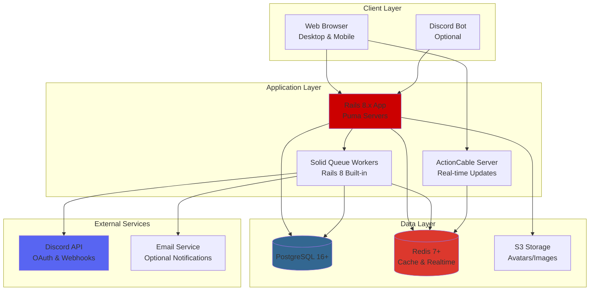
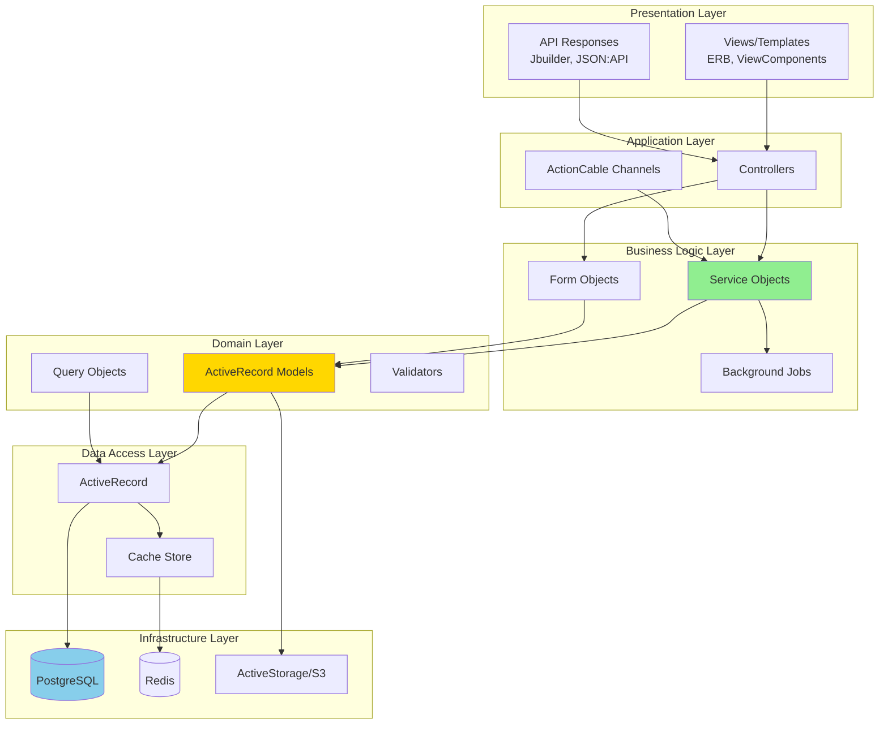
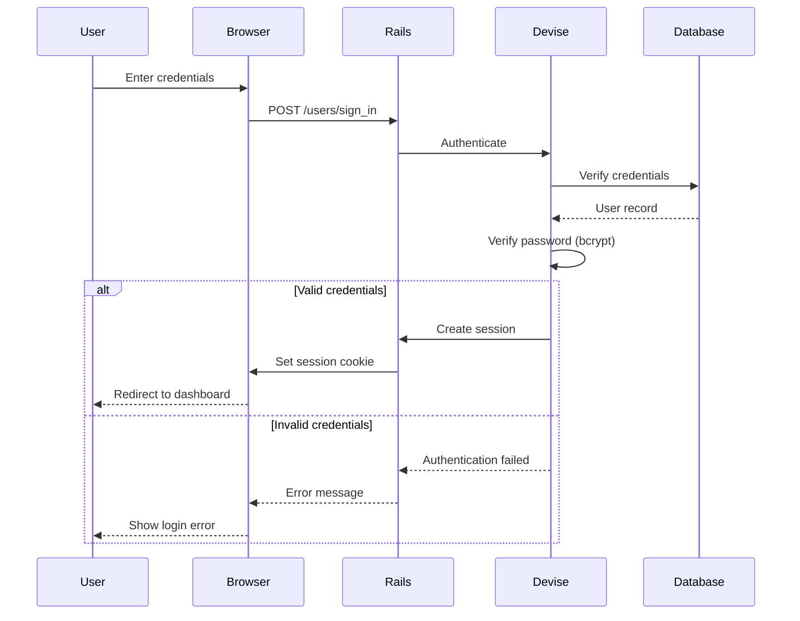

# Modern Architecture Plan
## GuildHub - Rails 8.x Implementation for Project 1999 EverQuest

**Version:** 2.0 (P99-Focused)
**Date:** October 19, 2025
**Target Rails Version:** 8.0+
**Target Ruby Version:** 3.3+
**Target Game:** Project 1999 EverQuest (Classic)

---

## Table of Contents
1. [Architecture Overview](#architecture-overview)
2. [Application Structure](#application-structure)
3. [Layer Architecture](#layer-architecture)
4. [Core Design Patterns](#core-design-patterns)
5. [Technology Stack](#technology-stack)
6. [Database Design](#database-design)
7. [API Architecture](#api-architecture)
8. [Frontend Architecture](#frontend-architecture)
9. [Security Architecture](#security-architecture)
10. [Deployment Architecture](#deployment-architecture)

---

## 1. Architecture Overview

### 1.1 Architectural Style

**GuildHub follows a modern Rails 8.x architecture optimized for P99 guilds:**



### 1.2 Architectural Principles (Simplified for P99)

1. **Convention over Configuration**: Leverage Rails 8 defaults (Solid Queue, Propshaft)
2. **RESTful Design**: Resource-oriented architecture
3. **Service Objects**: Extract complex business logic (DKP calculations, imports)
4. **Form Objects**: Encapsulate form handling (raid creation, item awards)
5. **View Components**: Reusable, testable view logic
6. **Simple API**: Lightweight API for Discord bot integration
7. **Background Processing**: Solid Queue for imports and Discord notifications
8. **Real-Time Updates**: Turbo Streams for live DKP standings

---

## 2. Application Structure

### 2.1 Rails Directory Structure

```
guildhub/
├── app/
│   ├── assets/              # CSS, images, fonts (Propshaft)
│   ├── channels/            # ActionCable channels (real-time updates)
│   ├── components/          # ViewComponents (reusable UI)
│   ├── controllers/
│   │   ├── api/             # Simple API controllers
│   │   │   └── v1/
│   │   ├── admin/           # Admin panel namespace
│   │   └── concerns/        # Controller mixins
│   ├── forms/               # Form objects (raid creation, item awards)
│   ├── helpers/             # View helpers
│   ├── javascript/          # Stimulus controllers
│   ├── jobs/                # Solid Queue background jobs
│   ├── mailers/             # Email templates (optional)
│   ├── models/
│   │   └── concerns/        # Model mixins (DKP calculations)
│   ├── policies/            # Pundit authorization policies
│   ├── queries/             # Query objects (standings, reports)
│   ├── serializers/         # JSON serializers (API responses)
│   ├── services/            # Service objects (DKP logic, imports)
│   ├── validators/          # Custom validators
│   └── views/
│       ├── api/             # JSON views (simple API)
│       ├── admin/           # Admin panel views
│       ├── layouts/
│       └── shared/
├── bin/                     # Executables (rails, setup, dev)
├── config/
│   ├── environments/        # Environment configs
│   ├── initializers/        # Gem configurations (Discord, Devise)
│   ├── locales/             # I18n translations (optional)
│   └── routes.rb            # Routing
├── db/
│   ├── migrate/             # Migrations
│   ├── seeds/               # Seed data (EQ classes, races, raid types)
│   └── schema.rb            # Schema definition
├── lib/
│   ├── tasks/               # Rake tasks (EQdkpPlus import)
│   └── importers/           # EQdkpPlus migration scripts
├── public/                  # Static files
├── spec/                    # RSpec tests
│   ├── factories/           # FactoryBot factories
│   ├── models/
│   ├── requests/            # Request specs (API)
│   ├── services/            # Service specs (DKP logic)
│   ├── system/              # System tests (Capybara)
│   └── support/             # Test helpers
├── storage/                 # ActiveStorage files (dev)
└── tmp/                     # Temporary files
```

### 2.2 Service-Based Organization

**P99-specific service objects:**

```ruby
# app/services/dkp/calculator_service.rb
module Dkp
  class CalculatorService
    def initialize(character)
      @character = character
    end

    def current_balance
      starting_balance +
        earned_points -
        spent_points +
        manual_adjustments -
        decay_amount
    end

    private

    def earned_points
      @character.raid_attendances.sum(:points_earned)
    end

    def spent_points
      @character.item_awards.sum(:points_cost)
    end

    def manual_adjustments
      @character.dkp_adjustments.sum(:points)
    end

    def decay_amount
      # Optional decay calculation based on guild config
      return 0 unless guild.dkp_decay_enabled?
      # ... decay logic
    end
  end
end
```

---

## 3. Layer Architecture

### 3.1 Layered Architecture Diagram



### 3.2 Layer Responsibilities

#### Presentation Layer
- **Views**: Rendering HTML with ERB/Haml
- **ViewComponents**: Reusable, testable components
- **API Responses**: JSON/XML output

#### Application Layer
- **Controllers**: HTTP request handling
- **ActionCable Channels**: WebSocket handling
- **Routing**: URL → Controller mapping

#### Business Logic Layer
- **Service Objects**: Complex business operations
- **Form Objects**: Form validation & submission
- **Background Jobs**: Asynchronous processing

#### Domain Layer
- **Models**: Business entities and relationships
- **Query Objects**: Complex query encapsulation
- **Validators**: Custom validation logic
- **Policies**: Authorization rules (Pundit)

#### Data Access Layer
- **ActiveRecord**: ORM
- **Cache**: Fragment/query caching
- **Search**: Full-text search (pg_search)

---

## 4. Core Design Patterns

### 4.1 Service Objects

```ruby
# app/services/raids/create_service.rb

module Raids
  class CreateService
    def initialize(guild:, params:, creator:)
      @guild = guild
      @params = params
      @creator = creator
    end

    def call
      ActiveRecord::Base.transaction do
        create_raid
        add_attendees
        calculate_points
        send_notifications
      end

      Result.success(raid: @raid)
    rescue => e
      Result.failure(error: e.message)
    end

    private

    def create_raid
      @raid = @guild.raids.create!(
        event_type_id: @params[:event_type_id],
        date: @params[:date],
        notes: @params[:notes],
        creator: @creator
      )
    end

    def add_attendees
      @params[:attendee_ids].each do |character_id|
        @raid.attendees.create!(character_id: character_id)
      end
    end

    def calculate_points
      PointCalculator.new(@raid).calculate!
    end

    def send_notifications
      RaidCreatedJob.perform_later(@raid.id)
    end
  end

  # Result object
  class Result
    attr_reader :raid, :error

    def self.success(raid:)
      new(success: true, raid: raid)
    end

    def self.failure(error:)
      new(success: false, error: error)
    end

    def initialize(success:, raid: nil, error: nil)
      @success = success
      @raid = raid
      @error = error
    end

    def success?
      @success
    end

    def failure?
      !@success
    end
  end
end

# Usage in controller
class RaidsController < ApplicationController
  def create
    result = Raids::CreateService.new(
      guild: current_guild,
      params: raid_params,
      creator: current_user
    ).call

    if result.success?
      redirect_to raid_path(result.raid), notice: "Raid created"
    else
      flash[:error] = result.error
      render :new
    end
  end
end
```

### 4.2 Form Objects

```ruby
# app/forms/raid_form.rb

class RaidForm
  include ActiveModel::Model
  include ActiveModel::Attributes

  attribute :event_type_id, :integer
  attribute :date, :datetime
  attribute :notes, :string
  attribute :attendee_ids, array: true
  attribute :point_override, :decimal

  validates :event_type_id, presence: true
  validates :date, presence: true
  validates :attendee_ids, presence: true

  def initialize(guild:, **attributes)
    @guild = guild
    super(attributes)
  end

  def save
    return false unless valid?

    Raids::CreateService.new(
      guild: @guild,
      params: to_service_params,
      creator: Current.user
    ).call
  end

  private

  def to_service_params
    {
      event_type_id: event_type_id,
      date: date,
      notes: notes,
      attendee_ids: attendee_ids,
      point_override: point_override
    }
  end
end

# Controller becomes simpler
class RaidsController < ApplicationController
  def create
    @form = RaidForm.new(guild: current_guild, **raid_params)

    if @form.save
      redirect_to raids_path, notice: "Raid created"
    else
      render :new
    end
  end
end
```

### 4.3 Query Objects

```ruby
# app/queries/character_standings_query.rb

class CharacterStandingsQuery
  def initialize(guild:, dkp_pool: nil)
    @guild = guild
    @dkp_pool = dkp_pool
  end

  def call
    query = Character
      .joins(:guild, :rank)
      .where(guild: @guild, status: :active)
      .select(
        'characters.*',
        'ranks.name as rank_name',
        calculate_points_subquery
      )

    query = query.where(dkp_pool_id: @dkp_pool) if @dkp_pool.present?

    query
      .order(current_points: :desc, name: :asc)
      .includes(:user, :main_character)
  end

  private

  def calculate_points_subquery
    <<~SQL
      (
        SELECT COALESCE(SUM(value), 0)
        FROM point_transactions
        WHERE point_transactions.character_id = characters.id
      ) as current_points
    SQL
  end
end

# Usage
standings = CharacterStandingsQuery.new(
  guild: current_guild,
  dkp_pool: params[:pool_id]
).call
```

### 4.4 ViewComponents

```ruby
# app/components/member_card_component.rb

class MemberCardComponent < ViewComponent::Base
  def initialize(character:, show_dkp: true)
    @character = character
    @show_dkp = show_dkp
  end

  def rank_badge_class
    {
      'guild_master' => 'badge-gold',
      'officer' => 'badge-silver',
      'member' => 'badge-bronze'
    }[@character.rank.slug] || 'badge-default'
  end

  private

  attr_reader :character
end

# app/components/member_card_component.html.erb
<div class="member-card" data-controller="member-card">
  <div class="member-card__header">
    <%= image_tag character.avatar_url, class: "avatar" %>
    <h3><%= character.name %></h3>
    <span class="badge <%= rank_badge_class %>">
      <%= character.rank.name %>
    </span>
  </div>

  <% if @show_dkp %>
    <div class="member-card__dkp">
      <span class="label">Current DKP:</span>
      <span class="value"><%= character.current_dkp %></span>
    </div>
  <% end %>

  <div class="member-card__actions">
    <%= link_to "View Profile", character_path(character), class: "btn btn-sm" %>
  </div>
</div>

# Usage in view
<%= render MemberCardComponent.new(character: @character, show_dkp: true) %>
```

### 4.5 Policy Objects (Pundit)

```ruby
# app/policies/raid_policy.rb

class RaidPolicy < ApplicationPolicy
  class Scope < Scope
    def resolve
      if user.admin?
        scope.all
      else
        scope.where(guild: user.guilds)
      end
    end
  end

  def index?
    user.member_of?(record.guild)
  end

  def show?
    user.member_of?(record.guild)
  end

  def create?
    user.raid_leader?(record.guild) || user.admin?
  end

  def update?
    user.raid_leader?(record.guild) || user.admin? || user.created?(record)
  end

  def destroy?
    user.admin? || (user.created?(record) && record.created_recently?)
  end

  def manage_attendees?
    update?
  end

  def award_items?
    user.loot_master?(record.guild) || user.admin?
  end
end

# Controller usage
class RaidsController < ApplicationController
  def create
    @raid = Raid.new(raid_params)
    authorize @raid  # Calls RaidPolicy#create?

    if @raid.save
      # ...
    end
  end

  def update
    @raid = Raid.find(params[:id])
    authorize @raid  # Calls RaidPolicy#update?

    # ...
  end
end
```

---

## 5. Technology Stack

### 5.1 Core Stack

```ruby
# Gemfile

ruby '3.2.2'

# Rails
gem 'rails', '~> 7.1'

# Database
gem 'pg', '~> 1.5'  # PostgreSQL

# Web Server
gem 'puma', '~> 6.0'

# Asset Pipeline
gem 'sprockets-rails'
gem 'jsbundling-rails'  # esbuild
gem 'cssbundling-rails'  # Tailwind CSS

# Authentication & Authorization
gem 'devise', '~> 4.9'
gem 'pundit', '~> 2.3'

# Background Jobs
gem 'sidekiq', '~> 7.0'
gem 'sidekiq-cron'  # Scheduled jobs

# Caching
gem 'redis', '~> 5.0'
gem 'redis-rails'

# File Uploads
gem 'aws-sdk-s3', require: false  # ActiveStorage backend

# Rich Text
gem 'image_processing', '~> 1.12'  # For ActiveStorage

# Search
gem 'pg_search', '~> 2.3'

# Pagination
gem 'kaminari', '~> 1.2'

# API
gem 'jbuilder', '~> 2.11'
gem 'jsonapi-serializer'  # Fast JSON:API serialization

# State Machine
gem 'aasm', '~> 5.5'

# Auditing
gem 'paper_trail', '~> 15.0'

# Tagging
gem 'acts-as-taggable-on', '~> 10.0'

# Friendly URLs
gem 'friendly_id', '~> 5.5'

# Settings
gem 'rails-settings-cached', '~> 2.9'

# Timezone
gem 'tzinfo-data'

# View Components
gem 'view_component', '~> 3.0'

# Hotwire
gem 'turbo-rails'
gem 'stimulus-rails'

# Recurring Events
gem 'ice_cube', '~> 0.16'

# i18n
gem 'rails-i18n', '~> 7.0'

group :development, :test do
  gem 'rspec-rails', '~> 6.0'
  gem 'factory_bot_rails', '~> 6.2'
  gem 'faker', '~> 3.2'
  gem 'pry-rails'
  gem 'pry-byebug'
end

group :development do
  gem 'annotate'  # Add schema comments to models
  gem 'bullet'  # N+1 query detection
  gem 'rails-erd'  # Generate ERD
  gem 'letter_opener'  # Preview emails in browser
end

group :test do
  gem 'shoulda-matchers', '~> 5.3'
  gem 'simplecov', require: false
  gem 'webmock', '~> 3.18'
  gem 'vcr', '~> 6.1'
end

group :production do
  gem 'lograge'  # Better logging
  gem 'exception_notification'
end
```

### 5.2 Frontend Stack

```json
// package.json
{
  "name": "guildhub",
  "private": true,
  "dependencies": {
    "@hotwired/stimulus": "^3.2.0",
    "@hotwired/turbo-rails": "^7.3.0",
    "esbuild": "^0.19.0",
    "chart.js": "^4.4.0",
    "fullcalendar": "^6.1.0",
    "flatpickr": "^4.6.13",
    "tom-select": "^2.3.0",
    "shepherd.js": "^11.2.0"
  },
  "scripts": {
    "build": "esbuild app/javascript/*.* --bundle --sourcemap --outdir=app/assets/builds --public-path=assets",
    "build:css": "tailwindcss -i ./app/assets/stylesheets/application.tailwind.css -o ./app/assets/builds/application.css --minify"
  },
  "devDependencies": {
    "tailwindcss": "^3.3.0"
  }
}
```

---

## 6. Database Design

### 6.1 Core Schema

```ruby
# db/schema.rb (P99-focused, simplified)

ActiveRecord::Schema[8.0].define(version: 2025_10_19_000000) do
  enable_extension "plpgsql"
  enable_extension "pg_trgm"  # For fuzzy search

  # Users (Discord OAuth primary)
  create_table "users", force: :cascade do |t|
    t.string "discord_id", null: false  # Primary auth via Discord
    t.string "discord_username"
    t.string "discord_avatar_url"
    t.string "email"  # Optional, from Discord
    t.string "encrypted_password"  # Only for admin panel users
    t.boolean "admin", default: false
    t.datetime "last_sign_in_at"
    t.inet "last_sign_in_ip"
    t.timestamps

    t.index ["discord_id"], name: "index_users_on_discord_id", unique: true
    t.index ["email"], name: "index_users_on_email"
  end

  # Guilds (P99 specific)
  create_table "guilds", force: :cascade do |t|
    t.string "name", null: false
    t.string "slug", null: false
    t.string "p99_server"  # "Blue" or "Green"
    t.jsonb "dkp_config", default: {}  # Single pool config per guild
    # dkp_config = {
    #   pool_name: "Main Raid DKP",
    #   starting_balance: 0,
    #   allow_decimals: false,
    #   decay_enabled: false,
    #   decay_percent: 0,
    #   point_cap: nil
    # }
    t.string "discord_webhook_url"  # For posting raid results
    t.timestamps

    t.index ["slug"], name: "index_guilds_on_slug", unique: true
  end

  # Characters (EverQuest specific)
  create_table "characters", force: :cascade do |t|
    t.bigint "guild_id", null: false
    t.bigint "user_id"  # Nullable until Discord link
    t.bigint "main_character_id"  # Self-referential for alts
    t.string "name", null: false
    t.string "eq_class", null: false  # 14 EQ classes
    t.string "eq_race", null: false   # 12 EQ races
    t.integer "level", default: 1
    t.integer "rank", default: 0  # enum: guild_leader, officer, member, recruit
    t.integer "status", default: 0  # enum: active, inactive, deleted
    t.text "notes"
    t.timestamps

    t.index ["guild_id"], name: "index_characters_on_guild_id"
    t.index ["user_id"], name: "index_characters_on_user_id"
    t.index ["main_character_id"], name: "index_characters_on_main_character_id"
    t.index ["guild_id", "name"], name: "index_characters_on_guild_id_and_name", unique: true
  end

  # Event Types (Raid types for P99)
  create_table "event_types", force: :cascade do |t|
    t.bigint "guild_id", null: false
    t.string "name", null: false  # PoF, PoH, Nagafen, etc.
    t.decimal "default_points", precision: 10, scale: 2
    t.string "icon_url"
    t.timestamps

    t.index ["guild_id"], name: "index_event_types_on_guild_id"
  end

  # Raids
  create_table "raids", force: :cascade do |t|
    t.bigint "guild_id", null: false
    t.bigint "event_type_id", null: false
    t.bigint "created_by_user_id", null: false
    t.datetime "raid_date", null: false
    t.decimal "points_awarded", precision: 10, scale: 2
    t.text "notes"  # ActionText for rich notes
    t.timestamps

    t.index ["guild_id"], name: "index_raids_on_guild_id"
    t.index ["event_type_id"], name: "index_raids_on_event_type_id"
    t.index ["raid_date"], name: "index_raids_on_raid_date"
  end

  # Raid Attendance
  create_table "raid_attendances", force: :cascade do |t|
    t.bigint "raid_id", null: false
    t.bigint "character_id", null: false
    t.decimal "points_earned", precision: 10, scale: 2  # Denormalized for history
    t.string "attendance_status", default: "present"  # present, late, left_early
    t.timestamps

    t.index ["raid_id"], name: "index_raid_attendances_on_raid_id"
    t.index ["character_id"], name: "index_raid_attendances_on_character_id"
    t.index ["raid_id", "character_id"], name: "index_raid_attendances_unique", unique: true
  end

  # Item Awards (Loot)
  create_table "item_awards", force: :cascade do |t|
    t.bigint "raid_id", null: false
    t.bigint "character_id", null: false
    t.string "item_name", null: false
    t.string "eq_item_id"  # Optional EQ item database ID
    t.decimal "points_cost", precision: 10, scale: 2
    t.text "notes"
    t.timestamps

    t.index ["raid_id"], name: "index_item_awards_on_raid_id"
    t.index ["character_id"], name: "index_item_awards_on_character_id"
  end

  # DKP Adjustments (Manual point changes)
  create_table "dkp_adjustments", force: :cascade do |t|
    t.bigint "guild_id", null: false
    t.bigint "character_id", null: false
    t.bigint "adjusted_by_user_id", null: false
    t.decimal "points", precision: 10, scale: 2  # Can be positive or negative
    t.string "reason", null: false
    t.timestamps

    t.index ["guild_id"], name: "index_dkp_adjustments_on_guild_id"
    t.index ["character_id"], name: "index_dkp_adjustments_on_character_id"
  end

  # Announcements (Guild news/posts)
  create_table "announcements", force: :cascade do |t|
    t.bigint "guild_id", null: false
    t.bigint "author_id", null: false
    t.string "title", null: false
    t.text "body"  # ActionText
    t.string "category", default: "general"  # news, raid, loot, general
    t.boolean "pinned", default: false
    t.integer "views_count", default: 0
    t.datetime "published_at"
    t.timestamps

    t.index ["guild_id"], name: "index_announcements_on_guild_id"
    t.index ["author_id"], name: "index_announcements_on_author_id"
  end

  # Add foreign keys
  add_foreign_key "characters", "guilds"
  add_foreign_key "characters", "users"
  add_foreign_key "event_types", "guilds"
  add_foreign_key "raids", "guilds"
  add_foreign_key "raids", "event_types"
  add_foreign_key "raid_attendances", "raids"
  add_foreign_key "raid_attendances", "characters"
  add_foreign_key "item_awards", "raids"
  add_foreign_key "item_awards", "characters"
  add_foreign_key "dkp_adjustments", "guilds"
  add_foreign_key "dkp_adjustments", "characters"
  add_foreign_key "announcements", "guilds"
  add_foreign_key "announcements", "users", column: "author_id"
end
```

### 6.2 Model Associations

```ruby
# app/models/user.rb
class User < ApplicationRecord
  devise :database_authenticatable, :registerable, :recoverable,
         :rememberable, :validatable, :confirmable, :trackable

  has_many :character_users, dependent: :destroy
  has_many :characters, through: :character_users
  has_many :guild_memberships
  has_many :guilds, through: :guild_memberships

  has_many :created_raids, class_name: 'Raid', foreign_key: 'creator_id'
  has_many :articles, foreign_key: 'author_id'

  validates :username, presence: true, uniqueness: true
  validates :time_zone, inclusion: { in: ActiveSupport::TimeZone.all.map(&:name) }
end

# app/models/character.rb
class Character < ApplicationRecord
  belongs_to :guild
  belongs_to :rank, optional: true
  belongs_to :main_character, class_name: 'Character', optional: true

  has_many :alt_characters, class_name: 'Character', foreign_key: 'main_character_id'
  has_many :character_users, dependent: :destroy
  has_many :users, through: :character_users

  has_many :raid_attendees
  has_many :raids, through: :raid_attendees
  has_many :items
  has_many :point_transactions

  enum status: { active: 0, inactive: 1, deleted: 2 }

  validates :name, presence: true
  validates :name, uniqueness: { scope: :guild_id }

  def current_dkp(pool = nil)
    query = point_transactions
    query = query.where(dkp_pool: pool) if pool

    query.sum(:value)
  end
end

# app/models/raid.rb
class Raid < ApplicationRecord
  belongs_to :guild
  belongs_to :event_type
  belongs_to :creator, class_name: 'User'

  has_many :raid_attendees, dependent: :destroy
  has_many :characters, through: :raid_attendees
  has_many :items, dependent: :destroy
  has_many :point_transactions, as: :transactionable

  validates :raid_date, presence: true

  after_create :calculate_points
  after_create :broadcast_creation

  private

  def calculate_points
    PointCalculatorJob.perform_later(id)
  end

  def broadcast_creation
    broadcast_append_to "guild_#{guild_id}_raids"
  end
end
```

---

## 7. API Architecture

### 7.1 RESTful API Design

```ruby
# config/routes.rb

Rails.application.routes.draw do
  namespace :api do
    namespace :v1 do
      defaults format: :json do
        resources :guilds, only: [:index, :show] do
          resources :characters, only: [:index, :show, :create, :update]
          resources :raids, only: [:index, :show, :create, :update] do
            post :complete, on: :member
            resources :attendees, only: [:create, :destroy]
          end
          resources :dkp_standings, only: [:index]
        end

        resource :user, only: [:show, :update]
        post 'auth/login', to: 'authentication#create'
        delete 'auth/logout', to: 'authentication#destroy'
      end
    end
  end
end
```

### 7.2 API Controllers

```ruby
# app/controllers/api/v1/base_controller.rb

module Api
  module V1
    class BaseController < ActionController::API
      include Pundit::Authorization

      before_action :authenticate_user!

      rescue_from ActiveRecord::RecordNotFound, with: :not_found
      rescue_from Pundit::NotAuthorizedError, with: :unauthorized

      private

      def not_found
        render json: { error: 'Not Found' }, status: :not_found
      end

      def unauthorized
        render json: { error: 'Unauthorized' }, status: :forbidden
      end
    end
  end
end

# app/controllers/api/v1/raids_controller.rb

module Api
  module V1
    class RaidsController < BaseController
      def index
        @guild = Guild.find(params[:guild_id])
        @raids = policy_scope(@guild.raids).includes(:event_type, :creator)

        render json: RaidSerializer.new(@raids).serializable_hash
      end

      def create
        @guild = Guild.find(params[:guild_id])
        result = Raids::CreateService.new(
          guild: @guild,
          params: raid_params,
          creator: current_user
        ).call

        if result.success?
          render json: RaidSerializer.new(result.raid).serializable_hash,
                 status: :created
        else
          render json: { errors: result.error }, status: :unprocessable_entity
        end
      end

      private

      def raid_params
        params.require(:raid).permit(
          :event_type_id, :raid_date, :notes, :point_value,
          attendee_ids: []
        )
      end
    end
  end
end
```

### 7.3 JSON Serializers

```ruby
# app/serializers/raid_serializer.rb

class RaidSerializer
  include JSONAPI::Serializer

  attributes :raid_date, :point_value, :notes, :created_at

  belongs_to :event_type
  belongs_to :creator, serializer: UserSerializer
  has_many :characters, through: :raid_attendees

  attribute :attendee_count do |raid|
    raid.raid_attendees.count
  end

  attribute :total_items_awarded do |raid|
    raid.items.count
  end

  link :self do |raid|
    "/api/v1/guilds/#{raid.guild_id}/raids/#{raid.id}"
  end
end
```

---

## 8. Frontend Architecture

### 8.1 Hotwire (Turbo + Stimulus)

```ruby
# app/views/raids/index.html.erb

<div id="raids" data-controller="raids-list">
  <%= turbo_frame_tag "raids_list" do %>
    <div class="raids-grid">
      <% @raids.each do |raid| %>
        <%= render RaidCardComponent.new(raid: raid) %>
      <% end %>
    </div>
  <% end %>

  <%= turbo_stream_from "guild_#{current_guild.id}_raids" %>
</div>
```

```javascript
// app/javascript/controllers/raids_list_controller.js

import { Controller } from "@hotwired/stimulus"

export default class extends Controller {
  static targets = ["list"]

  connect() {
    console.log("Raids list connected")
  }

  filter(event) {
    const filterValue = event.target.value

    this.listTargets.forEach(item => {
      const matchesFilter = item.dataset.raidType === filterValue || filterValue === "all"
      item.style.display = matchesFilter ? "block" : "none"
    })
  }
}
```

### 8.2 ViewComponents

Already shown in section 4.4. Components provide:
- Testable view logic
- Reusable UI elements
- Preview capability
- Performance benefits

### 8.3 Asset Pipeline

```ruby
# config/initializers/assets.rb

Rails.application.config.assets.version = "1.0"
Rails.application.config.assets.paths << Rails.root.join("node_modules")

# Precompile additional assets
Rails.application.config.assets.precompile += %w[
  application.js
  application.css
  admin.js
  admin.css
]
```

---

## 9. Security Architecture

### 9.1 Authentication Flow



### 9.2 Security Measures

```ruby
# config/initializers/devise.rb

Devise.setup do |config|
  config.mailer_sender = 'noreply@guildhub.com'

  # bcrypt cost factor (higher = more secure but slower)
  config.stretches = Rails.env.test? ? 1 : 12

  # Session management
  config.timeout_in = 30.minutes
  config.expire_all_remember_me_on_sign_out = true

  # Email confirmation
  config.reconfirmable = true
  config.send_email_changed_notification = true
  config.send_password_change_notification = true

  # Account locking
  config.lock_strategy = :failed_attempts
  config.unlock_strategy = :both  # time and email
  config.maximum_attempts = 5
  config.unlock_in = 1.hour

  # Password requirements
  config.password_length = 12..128
  config.password_complexity = {
    digit: 1,
    lower: 1,
    symbol: 1,
    upper: 1
  }
end
```

```ruby
# config/initializers/security.rb

Rails.application.config.middleware.use Rack::Attack

# Rate limiting
Rack::Attack.throttle("logins/ip", limit: 5, period: 20.seconds) do |req|
  req.ip if req.path == '/users/sign_in' && req.post?
end

Rack::Attack.throttle("api/ip", limit: 300, period: 5.minutes) do |req|
  req.ip if req.path.start_with?('/api/')
end

# Content Security Policy
Rails.application.config.content_security_policy do |policy|
  policy.default_src :self, :https
  policy.font_src    :self, :https, :data
  policy.img_src     :self, :https, :data
  policy.object_src  :none
  policy.script_src  :self, :https
  policy.style_src   :self, :https
end
```

---

## 10. Deployment Architecture

### 10.1 Docker Deployment

```dockerfile
# Dockerfile

FROM ruby:3.2.2-alpine AS builder

RUN apk add --no-cache \
    build-base \
    postgresql-dev \
    nodejs \
    yarn \
    tzdata

WORKDIR /app

COPY Gemfile Gemfile.lock ./
RUN bundle install --jobs 4 --retry 3

COPY package.json yarn.lock ./
RUN yarn install --frozen-lockfile

COPY . .

RUN bundle exec rails assets:precompile

# Production stage
FROM ruby:3.2.2-alpine

RUN apk add --no-cache \
    postgresql-client \
    tzdata \
    nodejs

WORKDIR /app

COPY --from=builder /usr/local/bundle /usr/local/bundle
COPY --from=builder /app /app

EXPOSE 3000

CMD ["bundle", "exec", "puma", "-C", "config/puma.rb"]
```

```yaml
# docker-compose.yml

version: '3.8'

services:
  db:
    image: postgres:15-alpine
    environment:
      POSTGRES_PASSWORD: ${DB_PASSWORD}
    volumes:
      - postgres_data:/var/lib/postgresql/data

  redis:
    image: redis:7-alpine
    volumes:
      - redis_data:/data

  web:
    build: .
    depends_on:
      - db
      - redis
    environment:
      DATABASE_URL: postgres://postgres:${DB_PASSWORD}@db:5432/guildhub_production
      REDIS_URL: redis://redis:6379/0
    ports:
      - "3000:3000"
    volumes:
      - ./storage:/app/storage

  sidekiq:
    build: .
    command: bundle exec sidekiq
    depends_on:
      - db
      - redis
    environment:
      DATABASE_URL: postgres://postgres:${DB_PASSWORD}@db:5432/guildhub_production
      REDIS_URL: redis://redis:6379/0

volumes:
  postgres_data:
  redis_data:
```

### 10.2 Cloud Deployment (Heroku/Railway)

```ruby
# config/puma.rb

max_threads_count = ENV.fetch("RAILS_MAX_THREADS") { 5 }
min_threads_count = ENV.fetch("RAILS_MIN_THREADS") { max_threads_count }
threads min_threads_count, max_threads_count

port ENV.fetch("PORT") { 3000 }

environment ENV.fetch("RAILS_ENV") { "development" }

pidfile ENV.fetch("PIDFILE") { "tmp/pids/server.pid" }

workers ENV.fetch("WEB_CONCURRENCY") { 2 }

preload_app!

on_worker_boot do
  ActiveRecord::Base.establish_connection
end
```

```yaml
# .github/workflows/deploy.yml

name: Deploy to Production

on:
  push:
    branches: [main]

jobs:
  deploy:
    runs-on: ubuntu-latest

    steps:
      - uses: actions/checkout@v3

      - name: Set up Ruby
        uses: ruby/setup-ruby@v1
        with:
          ruby-version: 3.3.0
          bundler-cache: true

      - name: Run tests
        run: bundle exec rspec

      - name: Deploy to Heroku
        uses: akhileshns/heroku-deploy@v3.12.14
        with:
          heroku_api_key: ${{ secrets.HEROKU_API_KEY }}
          heroku_app_name: "guildhub-production"
          heroku_email: ${{ secrets.HEROKU_EMAIL }}
```

---

**Document Control**

| Version | Date | Author | Changes |
|---------|------|--------|---------|
| 1.0 | 2025-10-19 | Architecture Team | Initial modern architecture plan |
