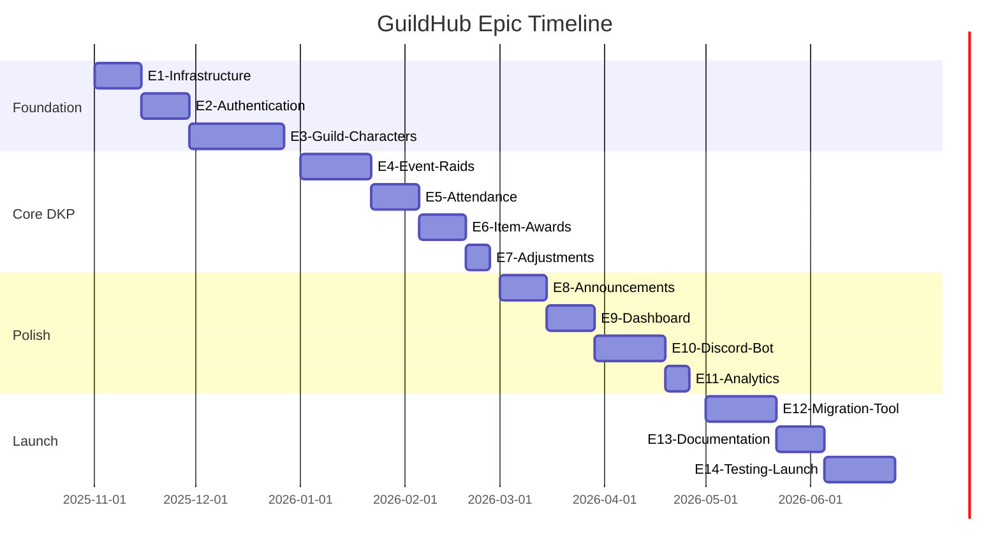

# GuildHub Implementation Tasks
## Project 1999 EverQuest DKP System

**Version:** 1.0 (Aligned with PRD v2.0 P99-Focused)
**Date:** October 19, 2025
**Project Duration:** 8 months (16 sprints × 2 weeks)
**Timeline:** November 2025 - June 2026
**Target:** Rails 8.x on Ruby 3.3+ with PostgreSQL 16+

---

## Table of Contents
1. [High-Level Epic Breakdown](#high-level-epic-breakdown)
2. [Phase 1: Foundation (Months 1-2)](#phase-1-foundation-months-1-2)
3. [Phase 2: Core DKP System (Months 3-4)](#phase-2-core-dkp-system-months-3-4)
4. [Phase 3: Content & Polish (Months 5-6)](#phase-3-content--polish-months-5-6)
5. [Phase 4: Migration & Launch (Months 7-8)](#phase-4-migration--launch-months-7-8)
6. [Cross-Cutting Concerns](#cross-cutting-concerns)
7. [Technical Debt & Refactoring](#technical-debt--refactoring)

---

## High-Level Epic Breakdown

### Epic Overview (30,000 ft view)

### Epic List

| ID | Epic Name | Story Points | Priority | Dependencies |
|----|-----------|--------------|----------|--------------|
| **E1** | Infrastructure Setup | 21 | P0 | None |
| **E2** | Discord OAuth Authentication | 13 | P0 | E1 |
| **E3** | Guild & Character Management | 21 | P0 | E2 |
| **E4** | Event Types & Raid Creation | 13 | P0 | E3 |
| **E5** | Raid Attendance Tracking | 13 | P0 | E4 |
| **E6** | Item Awards & DKP Spending | 13 | P0 | E5 |
| **E7** | Manual DKP Adjustments | 8 | P0 | E6 |
| **E8** | Announcements & Comments | 8 | P1 | E7 |
| **E9** | Dashboard & Standings | 13 | P1 | E7 |
| **E10** | Discord Bot Integration | 13 | P1 | E9 |
| **E11** | Analytics & Reporting | 8 | P2 | E9 |
| **E12** | EQdkpPlus Migration Tool | 21 | P0 | E7 |
| **E13** | Documentation & Guides | 8 | P1 | E12 |
| **E14** | Testing & Launch | 13 | P0 | E12, E13 |

**Total Story Points:** 166 SP (approximately 8 months at 20-25 SP/month for 1-2 devs)

---

## Phase 1: Foundation (Months 1-2)

### Epic 1: Infrastructure Setup (21 SP)

**Goal:** Set up production-ready Rails 8 foundation with CI/CD, testing, and deployment infrastructure.

#### Task Breakdown

##### 1.1 Rails Application Bootstrap (5 SP)

**Tasks:**
- [ ] **T1.1.1** - Initialize Rails 8.0+ application with PostgreSQL
  - `rails new guildhub --database=postgresql --css=tailwind --javascript=esbuild`
  - Ruby version: 3.3+
  - Verify Rails 8 defaults (Solid Queue, Propshaft)
  - **Acceptance:** `rails server` starts successfully
  - **Time:** 2 hours

- [ ] **T1.1.2** - Configure database.yml for PostgreSQL 16+
  - Development, test, production environments
  - Connection pooling (pool: 5)
  - Prepared statements enabled
  - Enable PostgreSQL extensions: `plpgsql`, `pg_trgm` (for fuzzy search)
  - **Acceptance:** `rails db:create` succeeds
  - **Time:** 1 hour

- [ ] **T1.1.3** - Set up Git repository and initial commit
  - Initialize `.gitignore` (credentials, tmp, log, storage)
  - Create README.md with setup instructions
  - Initial commit with clean Rails 8 skeleton
  - **Acceptance:** Clean git history, no ignored files committed
  - **Time:** 1 hour

- [ ] **T1.1.4** - Configure Rails credentials and secrets management
  - `rails credentials:edit --environment development`
  - `rails credentials:edit --environment production`
  - Secret key base
  - Database credentials
  - Discord OAuth secrets (placeholders)
  - **Acceptance:** Credentials encrypted, master.key in .gitignore
  - **Time:** 2 hours

- [ ] **T1.1.5** - Set up Redis for caching and ActionCable
  - Install Redis locally (brew/apt)
  - Configure `config/redis.yml`
  - Set cache_store to redis_cache_store
  - Configure ActionCable to use Redis adapter
  - **Acceptance:** `rails console` can connect to Redis
  - **Time:** 2 hours

##### 1.2 Development Environment (3 SP)

**Tasks:**
- [ ] **T1.2.1** - Create Docker development environment
  - `Dockerfile` for Rails app
  - `docker-compose.yml` with PostgreSQL, Redis, Rails
  - Volume mounts for live code reloading
  - **Acceptance:** `docker-compose up` starts all services
  - **Time:** 4 hours

- [ ] **T1.2.2** - Set up development scripts
  - `bin/setup` - Initial setup for new developers
  - `bin/dev` - Start development server with all services
  - `bin/test` - Run full test suite
  - **Acceptance:** New developer can `bin/setup && bin/dev`
  - **Time:** 2 hours

- [ ] **T1.2.3** - Configure development tools
  - Rubocop for linting (`.rubocop.yml`)
  - ERB Lint for templates
  - Brakeman for security scanning
  - Bundler-audit for dependency checks
  - **Acceptance:** `rubocop`, `brakeman` run without setup errors
  - **Time:** 2 hours

##### 1.3 Testing Infrastructure (5 SP)

**Tasks:**
- [ ] **T1.3.1** - Install and configure RSpec
  - `gem 'rspec-rails'`
  - `rails generate rspec:install`
  - Configure spec_helper, rails_helper
  - Set up database_cleaner
  - **Acceptance:** `bundle exec rspec` runs successfully
  - **Time:** 2 hours

- [ ] **T1.3.2** - Install FactoryBot and Faker
  - `gem 'factory_bot_rails'`
  - `gem 'faker'`
  - Configure FactoryBot in spec/support
  - Create example factory (user factory)
  - **Acceptance:** Can create test records with `create(:user)`
  - **Time:** 2 hours

- [ ] **T1.3.3** - Set up system tests with Capybara
  - `gem 'capybara'`
  - `gem 'selenium-webdriver'`
  - Configure headless Chrome
  - Create example system test (visit homepage)
  - **Acceptance:** System tests can interact with browser
  - **Time:** 3 hours

- [ ] **T1.3.4** - Configure SimpleCov for code coverage
  - `gem 'simplecov'`
  - Generate coverage reports in spec_helper
  - Set coverage threshold (80%)
  - **Acceptance:** Coverage report generated after test run
  - **Time:** 1 hour

- [ ] **T1.3.5** - Set up test data management
  - Create seed data for development (`db/seeds.rb`)
  - EverQuest classes and races constants
  - Sample P99 raid event types
  - **Acceptance:** `rails db:seed` creates sample data
  - **Time:** 2 hours

##### 1.4 CI/CD Pipeline (5 SP)

**Tasks:**
- [ ] **T1.4.1** - Create GitHub Actions workflow for CI
  - `.github/workflows/ci.yml`
  - Run RSpec tests
  - Run Rubocop
  - Run Brakeman security scan
  - Run Bundler-audit
  - Matrix: Ruby 3.3.x, PostgreSQL 16
  - **Acceptance:** CI runs on every push/PR
  - **Time:** 4 hours

- [ ] **T1.4.2** - Set up code coverage reporting
  - Integrate SimpleCov with GitHub Actions
  - Upload coverage to Codecov or similar
  - Badge in README.md
  - **Acceptance:** Coverage visible in PR comments
  - **Time:** 2 hours

- [ ] **T1.4.3** - Configure deployment automation (staging)
  - Set up staging environment (Render/Railway/Heroku)
  - Environment variables configuration
  - Automatic deployment from main branch
  - **Acceptance:** Push to main deploys to staging
  - **Time:** 4 hours

- [ ] **T1.4.4** - Set up production deployment pipeline
  - Production environment setup
  - Manual approval required for production
  - Database migration automation
  - Asset precompilation
  - **Acceptance:** Tagged release deploys to production
  - **Time:** 4 hours

##### 1.5 Core Gem Installation (3 SP)

**Tasks:**
- [ ] **T1.5.1** - Install authentication gems
  - `gem 'devise', '~> 4.9'` - Admin panel auth
  - `gem 'omniauth-discord'` - Discord OAuth
  - `gem 'omniauth-rails_csrf_protection'` - CSRF protection
  - Configure but don't implement yet
  - **Acceptance:** Gems installed, no errors
  - **Time:** 1 hour

- [ ] **T1.5.2** - Install authorization and audit gems
  - `gem 'pundit', '~> 2.3'` - Authorization
  - `gem 'paper_trail', '~> 15.0'` - Audit trail
  - **Acceptance:** Gems installed
  - **Time:** 1 hour

- [ ] **T1.5.3** - Install utility gems
  - `gem 'kaminari', '~> 1.2'` - Pagination
  - `gem 'pg_search', '~> 2.3'` - PostgreSQL search
  - `gem 'jsonapi-serializer'` - API responses
  - `gem 'view_component', '~> 3.0'` - UI components
  - **Acceptance:** Gems installed
  - **Time:** 1 hour

- [ ] **T1.5.4** - Install development and debugging gems
  - `gem 'pry-rails'` - Enhanced console
  - `gem 'bullet'` - N+1 query detection
  - `gem 'rack-mini-profiler'` - Performance profiling
  - `gem 'letter_opener'` - Email preview in development
  - **Acceptance:** Development tools available
  - **Time:** 1 hour

- [ ] **T1.5.5** - Configure Tailwind CSS 4.0+
  - Verify Tailwind configuration
  - Set up custom colors/fonts for P99 theme
  - Create base layout with Tailwind
  - **Acceptance:** Tailwind styles apply to pages
  - **Time:** 2 hours

---

### Epic 2: Discord OAuth Authentication (13 SP)

**Goal:** Implement Discord OAuth as primary authentication method + admin panel with Devise.

#### Task Breakdown

##### 2.1 Discord OAuth Setup (5 SP)

**Tasks:**
- [ ] **T2.1.1** - Create Discord Application
  - Register app at discord.com/developers
  - Configure OAuth2 redirect URIs
  - Copy Client ID and Client Secret
  - Set up bot permissions (optional for later)
  - **Acceptance:** Discord app created, credentials obtained
  - **Time:** 1 hour

- [ ] **T2.1.2** - Configure OmniAuth Discord
  - Add credentials to Rails credentials
  - Configure OmniAuth initializer
  - Set callback URL: `/auth/discord/callback`
  - Configure scopes: `identify`, `email`
  - **Acceptance:** OmniAuth configured in initializers
  - **Time:** 2 hours

- [ ] **T2.1.3** - Create Users migration and model
  - Migration: `rails g model User discord_id:string:uniq discord_username:string discord_avatar_url:string email:string encrypted_password:string admin:boolean`
  - Add indexes: discord_id (unique), email
  - Add NOT NULL constraint on discord_id
  - **Acceptance:** Migration runs, user table created
  - **Time:** 2 hours

- [ ] **T2.1.4** - Implement OmniAuth callback controller
  - `app/controllers/auth/callbacks_controller.rb`
  - Handle Discord callback
  - Create or update user from Discord data
  - Store Discord avatar URL
  - Set session
  - **Acceptance:** User created from Discord OAuth
  - **Time:** 3 hours

- [ ] **T2.1.5** - Add Discord login button
  - Create login page with Discord button
  - Style with Tailwind (Discord brand colors)
  - "Login with Discord" call-to-action
  - **Acceptance:** Can click button, redirects to Discord
  - **Time:** 2 hours

##### 2.2 Session Management (3 SP)

**Tasks:**
- [ ] **T2.2.1** - Implement session handling
  - Create `ApplicationController` helpers
  - `current_user` method
  - `user_signed_in?` method
  - `authenticate_user!` before_action
  - **Acceptance:** Session persists across requests
  - **Time:** 2 hours

- [ ] **T2.2.2** - Create logout functionality
  - Logout route and controller action
  - Clear session
  - Redirect to homepage
  - **Acceptance:** User can log out successfully
  - **Time:** 1 hour

- [ ] **T2.2.3** - Add user navigation UI
  - Display current user (Discord username + avatar) in nav
  - Logout button
  - Dropdown menu (ViewComponent)
  - **Acceptance:** User sees their info when logged in
  - **Time:** 3 hours

##### 2.3 Admin Panel Authentication (Devise) (3 SP)

**Tasks:**
- [ ] **T2.3.1** - Install Devise for admin users
  - `rails generate devise:install`
  - Configure Devise for User model (only for admins)
  - Add email/password fields to users table
  - **Acceptance:** Devise configured
  - **Time:** 2 hours

- [ ] **T2.3.2** - Create admin authentication flow
  - Admin login page: `/admin/login`
  - Separate from Discord OAuth
  - Only for users with `admin: true`
  - **Acceptance:** Admins can log in with email/password
  - **Time:** 3 hours

- [ ] **T2.3.3** - Implement admin panel access control
  - Create `Admin::BaseController`
  - `before_action :authenticate_admin!`
  - Redirect non-admins to homepage
  - **Acceptance:** Only admins can access /admin
  - **Time:** 2 hours

##### 2.4 User Authorization (Pundit) (2 SP)

**Tasks:**
- [ ] **T2.4.1** - Install and configure Pundit
  - `rails g pundit:install`
  - Create `ApplicationPolicy`
  - Add Pundit to ApplicationController
  - **Acceptance:** Pundit available in controllers
  - **Time:** 1 hour

- [ ] **T2.4.2** - Create UserPolicy
  - Define permissions: index, show, update, destroy
  - Only admins can manage users
  - Users can view their own profile
  - **Acceptance:** Authorization works as expected
  - **Time:** 2 hours

---

### Epic 3: Guild & Character Management (21 SP)

**Goal:** Implement guild creation, character management, and Discord account linking.

#### Task Breakdown

##### 3.1 Guild Model & CRUD (5 SP)

**Tasks:**
- [ ] **T3.1.1** - Create Guild migration and model
  - Migration: `rails g model Guild name:string slug:string:uniq p99_server:string dkp_config:jsonb discord_webhook_url:string`
  - Add indexes: slug (unique)
  - Default dkp_config: `{}`
  - **Acceptance:** Guild table created
  - **Time:** 2 hours

- [ ] **T3.1.2** - Implement Guild model validations
  - Validate presence: name, slug
  - Validate uniqueness: slug
  - Validate p99_server: inclusion in ['Blue', 'Green']
  - Generate slug from name (FriendlyId or custom)
  - **Acceptance:** Invalid guilds cannot be saved
  - **Time:** 2 hours

- [ ] **T3.1.3** - Create Guild CRUD controllers
  - `Admin::GuildsController` (admin only)
  - Actions: index, show, new, create, edit, update, destroy
  - Strong parameters for guild attributes
  - **Acceptance:** Admins can manage guilds
  - **Time:** 3 hours

- [ ] **T3.1.4** - Create Guild views
  - Index: List all guilds (admin)
  - Show: Guild detail page
  - Form: New/edit guild with DKP config
  - **Acceptance:** Full CRUD UI for guilds
  - **Time:** 4 hours

- [ ] **T3.1.5** - Implement DKP configuration UI
  - Form fields for dkp_config JSONB:
    - Pool name
    - Starting balance
    - Allow decimals
    - Decay settings
  - JavaScript for conditional fields
  - **Acceptance:** Can configure DKP settings via UI
  - **Time:** 3 hours

##### 3.2 Character Model & Management (8 SP)

**Tasks:**
- [ ] **T3.2.1** - Create Character migration and model
  - Migration: `rails g model Character guild:references user:references main_character:references name:string eq_class:string eq_race:string level:integer rank:integer status:integer notes:text`
  - Add indexes: guild_id, user_id, main_character_id
  - Unique index: [guild_id, name]
  - **Acceptance:** Character table created
  - **Time:** 2 hours

- [ ] **T3.2.2** - Define EverQuest constants
  - Create `lib/everquest/constants.rb`
  - Define EQ_CLASSES array (14 classes)
  - Define EQ_RACES array (12 races)
  - Autoload in `config/application.rb`
  - **Acceptance:** Constants available in models/views
  - **Time:** 1 hour

- [ ] **T3.2.3** - Implement Character model validations
  - Validate presence: name, eq_class, eq_race
  - Validate uniqueness: name (scoped to guild)
  - Validate inclusion: eq_class in EQ_CLASSES
  - Validate inclusion: eq_race in EQ_RACES
  - Validate level: 1-60
  - Define enums: rank, status
  - **Acceptance:** Invalid characters cannot be saved
  - **Time:** 3 hours

- [ ] **T3.2.4** - Implement Character associations
  - belongs_to :guild
  - belongs_to :user, optional: true
  - belongs_to :main_character, optional: true (self-referential)
  - has_many :alt_characters (self-referential)
  - **Acceptance:** Associations work correctly
  - **Time:** 2 hours

- [ ] **T3.2.5** - Create Character CRUD controllers
  - `GuildsController` with nested characters
  - Actions: index, show, new, create, edit, update, destroy
  - Authorize: Officers can manage characters
  - **Acceptance:** Officers can manage guild characters
  - **Time:** 4 hours

- [ ] **T3.2.6** - Create Character views
  - Index: List guild characters (table view)
  - Show: Character detail page
  - Form: New/edit character (class/race dropdowns)
  - Filter: By class, race, rank, status
  - **Acceptance:** Full CRUD UI for characters
  - **Time:** 5 hours

- [ ] **T3.2.7** - Implement character import from CSV
  - Upload CSV with columns: name, class, race, level
  - Parse and validate CSV
  - Bulk create characters
  - Error handling for duplicates
  - **Acceptance:** Can bulk import characters from CSV
  - **Time:** 4 hours

- [ ] **T3.2.8** - Create main/alt character linking UI
  - Dropdown to select main character
  - Display alt tree on character show page
  - Prevent circular references
  - **Acceptance:** Alts correctly linked to mains
  - **Time:** 3 hours

##### 3.3 Discord Account Linking (5 SP)

**Tasks:**
- [ ] **T3.3.1** - Create character claiming flow
  - User views unclaimed characters in their guild
  - "Claim Character" button
  - Officer approval required
  - **Acceptance:** Users can claim characters
  - **Time:** 4 hours

- [ ] **T3.3.2** - Implement officer approval workflow
  - Pending claims list for officers
  - Approve/reject buttons
  - Notifications on approval
  - **Acceptance:** Officers can approve character claims
  - **Time:** 3 hours

- [ ] **T3.3.3** - Create "My Characters" dashboard
  - List of user's claimed characters
  - Set primary character
  - Unlink character (requires officer approval)
  - **Acceptance:** Users can manage their characters
  - **Time:** 3 hours

- [ ] **T3.3.4** - Display Discord info on characters
  - Show Discord avatar on character page
  - Show online/offline status (future: via Discord bot)
  - Link to Discord profile
  - **Acceptance:** Discord info visible on character pages
  - **Time:** 2 hours

##### 3.4 Character Policies (Pundit) (3 SP)

**Tasks:**
- [ ] **T3.4.1** - Create CharacterPolicy
  - Guild leaders can manage all characters
  - Officers can manage characters in their guild
  - Members can view characters
  - Users can claim their own characters
  - **Acceptance:** Authorization works correctly
  - **Time:** 3 hours

- [ ] **T3.4.2** - Add policy tests
  - RSpec for CharacterPolicy
  - Test all permission scenarios
  - 100% coverage for policy
  - **Acceptance:** All policy tests pass
  - **Time:** 2 hours

- [ ] **T3.4.3** - Implement policy enforcement in controllers
  - `authorize @character` in controller actions
  - Handle Pundit::NotAuthorizedError
  - Display appropriate error messages
  - **Acceptance:** Unauthorized actions blocked
  - **Time:** 2 hours

---

## Phase 2: Core DKP System (Months 3-4)

### Epic 4: Event Types & Raid Creation (13 SP)

**Goal:** Create raid event type templates and raid creation functionality.

#### Task Breakdown

##### 4.1 Event Type Model (3 SP)

**Tasks:**
- [ ] **T4.1.1** - Create EventType migration and model
  - Migration: `rails g model EventType guild:references name:string default_points:decimal icon_url:string`
  - Add index: guild_id
  - decimal precision: 10, scale: 2
  - **Acceptance:** EventType table created
  - **Time:** 1 hour

- [ ] **T4.1.2** - Seed P99 event types
  - Create seed data for common P99 raids:
    - Plane of Fear (3 points)
    - Plane of Hate (3 points)
    - Plane of Sky (5 points)
    - Nagafen (2 points)
    - Vox (2 points)
    - Innoruuk (2 points)
    - Cazic-Thule (2 points)
  - Add to `db/seeds.rb`
  - **Acceptance:** Seed creates event types
  - **Time:** 2 hours

- [ ] **T4.1.3** - Create EventType CRUD
  - Admin/Officer can manage event types
  - Index, show, new, create, edit, update, destroy
  - **Acceptance:** Event types manageable via UI
  - **Time:** 3 hours

##### 4.2 Raid Model (5 SP)

**Tasks:**
- [ ] **T4.2.1** - Create Raid migration and model
  - Migration: `rails g model Raid guild:references event_type:references created_by_user:references raid_date:datetime points_awarded:decimal notes:text`
  - Add indexes: guild_id, event_type_id, raid_date, created_by_user_id
  - **Acceptance:** Raid table created
  - **Time:** 2 hours

- [ ] **T4.2.2** - Implement Raid model associations and validations
  - belongs_to :guild
  - belongs_to :event_type
  - belongs_to :created_by_user, class_name: 'User'
  - has_many :raid_attendances
  - has_many :item_awards
  - Validations: presence of guild, event_type, raid_date, points_awarded
  - **Acceptance:** Raid model validated correctly
  - **Time:** 2 hours

- [ ] **T4.2.3** - Create Raid creation form
  - Select event type (dropdown)
  - Raid date/time picker
  - Points awarded (pre-filled from event type, editable)
  - Notes field (ActionText for rich formatting)
  - **Acceptance:** Can create raids via form
  - **Time:** 4 hours

- [ ] **T4.2.4** - Implement ActionText for raid notes
  - Add ActionText to Raid model
  - `has_rich_text :notes`
  - Configure Trix editor in form
  - **Acceptance:** Rich text works in raid notes
  - **Time:** 2 hours

- [ ] **T4.2.5** - Create Raid index and show pages
  - Index: List raids (paginated), filter by date range, event type
  - Show: Raid detail with attendees and items
  - **Acceptance:** Can browse raid history
  - **Time:** 4 hours

##### 4.3 Raid Management UI (5 SP)

**Tasks:**
- [ ] **T4.3.1** - Create raid list with filters
  - Filter by: Date range, event type, created by
  - Sort by: Date (newest first), points awarded
  - Pagination (25 per page)
  - **Acceptance:** Filterable raid list
  - **Time:** 4 hours

- [ ] **T4.3.2** - Implement raid edit/update
  - Officers can edit raids
  - Update points awarded
  - Update raid date
  - Update notes
  - **Acceptance:** Raids can be updated
  - **Time:** 3 hours

- [ ] **T4.3.3** - Implement raid deletion
  - Officers can delete raids
  - Confirmation modal
  - Cascade delete attendances and items
  - **Acceptance:** Raids can be deleted safely
  - **Time:** 2 hours

- [ ] **T4.3.4** - Add raid quick stats
  - Show attendee count
  - Show items awarded count
  - Show total DKP distributed
  - **Acceptance:** Stats visible on raid pages
  - **Time:** 2 hours

---

### Epic 5: Raid Attendance Tracking (13 SP)

**Goal:** Implement attendance tracking with bulk add/remove functionality.

#### Task Breakdown

##### 5.1 RaidAttendance Model (3 SP)

**Tasks:**
- [ ] **T5.1.1** - Create RaidAttendance migration and model
  - Migration: `rails g model RaidAttendance raid:references character:references points_earned:decimal attendance_status:string`
  - Add indexes: raid_id, character_id
  - Unique index: [raid_id, character_id]
  - **Acceptance:** RaidAttendance table created
  - **Time:** 2 hours

- [ ] **T5.1.2** - Implement RaidAttendance validations
  - belongs_to :raid
  - belongs_to :character
  - Validates uniqueness: character_id scoped to raid_id
  - Default points_earned from raid.points_awarded
  - Default attendance_status: 'present'
  - **Acceptance:** Validations work correctly
  - **Time:** 2 hours

- [ ] **T5.1.3** - Add attendance status enum
  - Define statuses: present, late, left_early
  - Color coding for each status
  - **Acceptance:** Status enum works
  - **Time:** 1 hour

##### 5.2 Attendance UI (5 SP)

**Tasks:**
- [ ] **T5.2.1** - Create attendance management interface
  - Embedded in raid show page
  - List current attendees (table)
  - Add/remove attendee buttons
  - **Acceptance:** Can view attendees on raid page
  - **Time:** 3 hours

- [ ] **T5.2.2** - Implement single attendee add
  - Modal or inline form
  - Character dropdown (guild characters only)
  - Points earned (editable)
  - Attendance status dropdown
  - **Acceptance:** Can add individual attendee
  - **Time:** 3 hours

- [ ] **T5.2.3** - Implement bulk attendee add
  - Multi-select character list
  - Checkboxes for each character
  - "Add Selected" button
  - Apply same points to all
  - **Acceptance:** Can add multiple attendees at once
  - **Time:** 4 hours

- [ ] **T5.2.4** - Implement attendee removal
  - Remove button per attendee
  - Confirmation modal
  - Recalculate DKP on removal
  - **Acceptance:** Can remove attendees
  - **Time:** 2 hours

- [ ] **T5.2.5** - Implement attendance status update
  - Inline dropdown for status change
  - Auto-save on change (Stimulus)
  - **Acceptance:** Can update attendance status
  - **Time:** 3 hours

##### 5.3 Attendance Queries (3 SP)

**Tasks:**
- [ ] **T5.3.1** - Create AttendanceQuery object
  - Query characters by attendance frequency
  - Filter by date range
  - Order by total raids attended
  - **Acceptance:** Query returns correct results
  - **Time:** 3 hours

- [ ] **T5.3.2** - Implement attendance reporting
  - Character attendance report (X raids attended)
  - Attendance percentage per character
  - Export to CSV
  - **Acceptance:** Attendance reports accurate
  - **Time:** 4 hours

##### 5.4 Real-time Updates (Turbo) (2 SP)

**Tasks:**
- [ ] **T5.4.1** - Implement Turbo Streams for attendance
  - Broadcast attendance additions
  - Broadcast attendance removals
  - Update raid show page in real-time
  - **Acceptance:** Changes appear live without refresh
  - **Time:** 4 hours

---

### Epic 6: Item Awards & DKP Spending (13 SP)

**Goal:** Track loot awards and DKP spending.

#### Task Breakdown

##### 6.1 ItemAward Model (3 SP)

**Tasks:**
- [ ] **T6.1.1** - Create ItemAward migration and model
  - Migration: `rails g model ItemAward raid:references character:references item_name:string eq_item_id:string points_cost:decimal notes:text`
  - Add indexes: raid_id, character_id, item_name
  - **Acceptance:** ItemAward table created
  - **Time:** 2 hours

- [ ] **T6.1.2** - Implement ItemAward validations
  - belongs_to :raid
  - belongs_to :character
  - Validates presence: item_name, points_cost
  - points_cost >= 0
  - **Acceptance:** Validations work
  - **Time:** 2 hours

- [ ] **T6.1.3** - Add ItemAward to PaperTrail
  - Enable versioning: `has_paper_trail`
  - Track all item award changes
  - Track who awarded item (whodunnit)
  - **Acceptance:** Item awards tracked in versions
  - **Time:** 1 hour

##### 6.2 Item Award UI (5 SP)

**Tasks:**
- [ ] **T6.2.1** - Create item award form
  - Embedded in raid show page
  - Character dropdown
  - Item name input (autocomplete future enhancement)
  - Points cost input
  - Notes field
  - **Acceptance:** Can award items via form
  - **Time:** 4 hours

- [ ] **T6.2.2** - Display item awards on raid page
  - Table of item awards
  - Show: Character, Item, Cost
  - Edit/delete buttons
  - **Acceptance:** Items visible on raid page
  - **Time:** 3 hours

- [ ] **T6.2.3** - Implement item award editing
  - Edit item cost (if mistake)
  - Edit recipient (rare case)
  - Audit trail maintained
  - **Acceptance:** Can edit item awards
  - **Time:** 3 hours

- [ ] **T6.2.4** - Implement item award rollback
  - Delete item award
  - Restore DKP to character
  - Confirmation with reason
  - **Acceptance:** Can rollback item awards
  - **Time:** 3 hours

##### 6.3 Loot History (3 SP)

**Tasks:**
- [ ] **T6.3.1** - Create character loot history page
  - Show all items received by character
  - Date, raid, item name, cost
  - Paginated
  - **Acceptance:** Character loot history visible
  - **Time:** 3 hours

- [ ] **T6.3.2** - Create guild loot history page
  - Show all items awarded in guild
  - Filter by: Date range, character, item name
  - Export to CSV
  - **Acceptance:** Guild loot history browsable
  - **Time:** 4 hours

- [ ] **T6.3.3** - Implement loot search
  - Search by item name
  - Search by character name
  - Full-text search (pg_search)
  - **Acceptance:** Can search loot history
  - **Time:** 3 hours

##### 6.4 DKP Calculation Integration (2 SP)

**Tasks:**
- [ ] **T6.4.1** - Create Dkp::CalculatorService
  - Calculate current balance for character
  - Sum earned (raid_attendances.points_earned)
  - Sum spent (item_awards.points_cost)
  - Sum adjustments
  - **Acceptance:** DKP calculation correct
  - **Time:** 3 hours

- [ ] **T6.4.2** - Add DKP balance to character model
  - Method: `character.current_dkp`
  - Cache result in Redis (5 min TTL)
  - Invalidate on: attendance, item award, adjustment
  - **Acceptance:** DKP balance accessible and cached
  - **Time:** 3 hours

---

### Epic 7: Manual DKP Adjustments (8 SP)

**Goal:** Allow officers to manually adjust DKP with audit trail.

#### Task Breakdown

##### 7.1 DkpAdjustment Model (2 SP)

**Tasks:**
- [ ] **T7.1.1** - Create DkpAdjustment migration and model
  - Migration: `rails g model DkpAdjustment guild:references character:references adjusted_by_user:references points:decimal reason:string`
  - Add indexes: guild_id, character_id, adjusted_by_user_id
  - **Acceptance:** DkpAdjustment table created
  - **Time:** 2 hours

- [ ] **T7.1.2** - Implement DkpAdjustment validations
  - belongs_to :guild, :character, :adjusted_by_user
  - Validates presence: points, reason
  - Enable PaperTrail versioning
  - **Acceptance:** Validations work
  - **Time:** 2 hours

##### 7.2 Single Adjustment UI (3 SP)

**Tasks:**
- [ ] **T7.2.1** - Create adjustment form
  - Accessible from character show page
  - Points input (positive or negative)
  - Reason text field (required)
  - Preview new balance
  - **Acceptance:** Can create single adjustment
  - **Time:** 3 hours

- [ ] **T7.2.2** - Display adjustment history
  - Show all adjustments for character
  - Date, points, reason, adjusted by
  - **Acceptance:** Adjustment history visible
  - **Time:** 2 hours

- [ ] **T7.2.3** - Implement adjustment authorization
  - Only officers can create adjustments
  - CharacterPolicy update
  - **Acceptance:** Authorization enforced
  - **Time:** 2 hours

##### 7.3 Mass Adjustment UI (3 SP)

**Tasks:**
- [ ] **T7.3.1** - Create bulk adjustment form
  - Select multiple characters
  - Apply same adjustment to all
  - Use cases: Decay, bonus, correction
  - **Acceptance:** Can create bulk adjustments
  - **Time:** 4 hours

- [ ] **T7.3.2** - Implement decay application
  - Apply percentage decay to all characters
  - Preview before applying
  - Reason: "Monthly decay (X%)"
  - **Acceptance:** Decay can be applied
  - **Time:** 3 hours

- [ ] **T7.3.3** - Implement bonus application
  - Apply fixed bonus to specific characters
  - Reason: "Holiday bonus" etc.
  - **Acceptance:** Bonus can be applied
  - **Time:** 2 hours

---

## Phase 3: Content & Polish (Months 5-6)

### Epic 8: Announcements & Comments (8 SP)

**Goal:** Simple guild announcement system with comments.

#### Task Breakdown

##### 8.1 Announcement Model (3 SP)

**Tasks:**
- [ ] **T8.1.1** - Create Announcement migration and model
  - Migration: `rails g model Announcement guild:references author:references title:string body:text category:string pinned:boolean views_count:integer published_at:datetime`
  - Add indexes: guild_id, author_id, published_at
  - **Acceptance:** Announcement table created
  - **Time:** 2 hours

- [ ] **T8.1.2** - Implement Announcement associations
  - belongs_to :guild
  - belongs_to :author, class_name: 'User'
  - has_rich_text :body (ActionText)
  - Scopes: published, pinned, by_category
  - **Acceptance:** Associations and scopes work
  - **Time:** 2 hours

- [ ] **T8.1.3** - Add announcement validations
  - Validates presence: title, body
  - Validates inclusion: category in ['news', 'raid', 'loot', 'general']
  - **Acceptance:** Validations work
  - **Time:** 1 hour

##### 8.2 Announcement CRUD (3 SP)

**Tasks:**
- [ ] **T8.2.1** - Create announcement form
  - Title input
  - Category dropdown
  - Rich text editor (Trix)
  - Pinned checkbox (officers only)
  - Publish/Draft toggle
  - **Acceptance:** Can create announcements
  - **Time:** 4 hours

- [ ] **T8.2.2** - Create announcement index page
  - List announcements (paginated)
  - Pinned announcements at top
  - Filter by category
  - **Acceptance:** Can browse announcements
  - **Time:** 3 hours

- [ ] **T8.2.3** - Create announcement show page
  - Display full announcement
  - Author info and date
  - View count increment
  - Edit/delete buttons (officers)
  - **Acceptance:** Announcements readable
  - **Time:** 2 hours

##### 8.3 Comments (Simple) (2 SP)

**Tasks:**
- [ ] **T8.3.1** - Add basic comments to announcements
  - Text-only comments (no threading initially)
  - Comment form at bottom of announcement
  - Display comment list
  - **Acceptance:** Can comment on announcements
  - **Time:** 4 hours

- [ ] **T8.3.2** - Implement comment moderation
  - Officers can delete comments
  - Users can edit/delete own comments (5 min window)
  - **Acceptance:** Comments moderated
  - **Time:** 2 hours

---

### Epic 9: Dashboard & Standings (13 SP)

**Goal:** Create guild dashboard and DKP standings page.

#### Task Breakdown

##### 9.1 DKP Standings Page (5 SP)

**Tasks:**
- [ ] **T9.1.1** - Create DkpStandingsQuery
  - Query all active characters with calculated DKP
  - Join raid_attendances, item_awards, dkp_adjustments
  - Calculate: earned, spent, adjustments, current balance
  - Order by current balance DESC
  - **Acceptance:** Query returns correct standings
  - **Time:** 4 hours

- [ ] **T9.1.2** - Create standings view
  - Table: Rank, Character, Class, DKP
  - Columns: Earned, Spent, Adjustments, Current
  - Color coding for class
  - Clickable rows to character detail
  - **Acceptance:** Standings page displays correctly
  - **Time:** 4 hours

- [ ] **T9.1.3** - Implement standings filters
  - Filter by: Class, rank, status
  - Search by character name
  - **Acceptance:** Filterable standings
  - **Time:** 3 hours

- [ ] **T9.1.4** - Add standings export
  - Export to CSV
  - Include all columns
  - Timestamp in filename
  - **Acceptance:** Can export standings
  - **Time:** 2 hours

- [ ] **T9.1.5** - Implement standings caching
  - Cache full standings in Redis (5 min TTL)
  - Invalidate on: raid, item award, adjustment
  - Cache key: guild_id + timestamp
  - **Acceptance:** Standings load fast (<200ms)
  - **Time:** 3 hours

##### 9.2 Guild Dashboard (5 SP)

**Tasks:**
- [ ] **T9.2.1** - Create guild dashboard layout
  - Grid layout with widgets (Tailwind)
  - Recent announcements widget
  - DKP standings widget (top 10)
  - Recent raids widget
  - Recent loot widget
  - **Acceptance:** Dashboard renders with widgets
  - **Time:** 4 hours

- [ ] **T9.2.2** - Implement recent announcements widget
  - Show 5 most recent published announcements
  - Title, author, date
  - Link to full announcement
  - **Acceptance:** Widget shows announcements
  - **Time:** 2 hours

- [ ] **T9.2.3** - Implement DKP standings widget
  - Show top 10 characters by DKP
  - Mini table: Rank, name, DKP
  - Link to full standings page
  - **Acceptance:** Widget shows top 10
  - **Time:** 2 hours

- [ ] **T9.2.4** - Implement recent raids widget
  - Show 5 most recent raids
  - Event type, date, attendees count
  - Link to raid detail
  - **Acceptance:** Widget shows raids
  - **Time:** 2 hours

- [ ] **T9.2.5** - Implement recent loot widget
  - Show 10 most recent item awards
  - Character, item, cost
  - **Acceptance:** Widget shows loot
  - **Time:** 2 hours

##### 9.3 Character Dashboard (3 SP)

**Tasks:**
- [ ] **T9.3.1** - Create character dashboard page
  - View own characters
  - Primary character highlighted
  - DKP balance for each
  - **Acceptance:** User sees their character info
  - **Time:** 3 hours

- [ ] **T9.3.2** - Add character stats widget
  - Total raids attended
  - Total items received
  - DKP balance breakdown (earned/spent)
  - **Acceptance:** Stats displayed correctly
  - **Time:** 3 hours

- [ ] **T9.3.3** - Add personal raid history
  - List raids character attended
  - Date, event type, points earned
  - Paginated
  - **Acceptance:** Personal raid history visible
  - **Time:** 3 hours

---

### Epic 10: Discord Bot Integration (13 SP)

**Goal:** Optional Discord bot with /dkp commands and webhook notifications.

#### Task Breakdown

##### 10.1 Discord Bot Setup (3 SP)

**Tasks:**
- [ ] **T10.1.1** - Install Discord bot gem
  - `gem 'discordrb', '~> 3.5'`
  - Configure bot token in credentials
  - **Acceptance:** Gem installed
  - **Time:** 1 hour

- [ ] **T10.1.2** - Create Discord bot application
  - Register bot at discord.com/developers
  - Set permissions: Read Messages, Send Messages
  - Copy bot token
  - **Acceptance:** Bot registered
  - **Time:** 1 hour

- [ ] **T10.1.3** - Create bot runner script
  - `lib/discord_bot/runner.rb`
  - Connect to Discord API
  - Ping/pong test
  - Run as background process
  - **Acceptance:** Bot connects to Discord
  - **Time:** 3 hours

##### 10.2 Bot Commands (5 SP)

**Tasks:**
- [ ] **T10.2.1** - Implement /dkp command
  - Usage: `/dkp [character_name]`
  - Look up character in guild
  - Return current DKP balance
  - Handle character not found
  - **Acceptance:** /dkp command works
  - **Time:** 4 hours

- [ ] **T10.2.2** - Implement /standings command
  - Usage: `/standings`
  - Return top 10 DKP standings
  - Formatted message (Discord embed)
  - **Acceptance:** /standings command works
  - **Time:** 3 hours

- [ ] **T10.2.3** - Implement /raids command
  - Usage: `/raids`
  - Return 5 most recent raids
  - Event type, date, attendees
  - **Acceptance:** /raids command works
  - **Time:** 3 hours

- [ ] **T10.2.4** - Implement /loot command
  - Usage: `/loot [character_name]`
  - Return recent loot for character
  - Item name, date, cost
  - **Acceptance:** /loot command works
  - **Time:** 3 hours

##### 10.3 Webhook Notifications (3 SP)

**Tasks:**
- [ ] **T10.3.1** - Create webhook service
  - `app/services/discord/webhook_service.rb`
  - Send formatted messages to webhook URL
  - Handle errors gracefully
  - **Acceptance:** Can send webhooks
  - **Time:** 3 hours

- [ ] **T10.3.2** - Post raid results to Discord
  - After raid created
  - Include: Event type, attendees count, items awarded
  - **Acceptance:** Raid results posted automatically
  - **Time:** 3 hours

- [ ] **T10.3.3** - Post item awards to Discord
  - After item awarded
  - Include: Character, item, cost
  - Optional role mention for officers
  - **Acceptance:** Item awards posted to Discord
  - **Time:** 2 hours

##### 10.4 Bot Management UI (2 SP)

**Tasks:**
- [ ] **T10.4.1** - Create bot configuration page
  - Enable/disable bot
  - Configure webhook URL
  - Test connection button
  - **Acceptance:** Bot configurable via UI
  - **Time:** 3 hours

- [ ] **T10.4.2** - Document bot setup guide
  - Add bot to Discord server instructions
  - Set webhook URL instructions
  - Command reference
  - **Acceptance:** Documentation complete
  - **Time:** 2 hours

---

### Epic 11: Analytics & Reporting (8 SP)

**Goal:** Basic analytics and exportable reports.

#### Task Breakdown

##### 11.1 Guild Analytics Page (4 SP)

**Tasks:**
- [ ] **T11.1.1** - Create analytics dashboard
  - Chart.js integration
  - Line chart: Raids over time
  - Bar chart: Loot by class
  - Pie chart: DKP distribution
  - **Acceptance:** Charts display correctly
  - **Time:** 5 hours

- [ ] **T11.1.2** - Implement raid frequency report
  - Raids per week/month
  - Trend over time (Chart.js line chart)
  - Filter by event type
  - **Acceptance:** Raid frequency chart works
  - **Time:** 3 hours

- [ ] **T11.1.3** - Implement loot distribution report
  - Items awarded by class (bar chart)
  - DKP spent by class
  - Identify imbalances
  - **Acceptance:** Loot distribution visible
  - **Time:** 3 hours

##### 11.2 Attendance Analytics (2 SP)

**Tasks:**
- [ ] **T11.2.1** - Create attendance reports
  - Attendance percentage per character
  - Identify inactive raiders
  - Chart: Attendance over time
  - **Acceptance:** Attendance reports work
  - **Time:** 4 hours

- [ ] **T11.2.2** - Implement activity heatmap
  - Calendar heatmap of raid activity
  - Identify busy/slow periods
  - **Acceptance:** Heatmap displays
  - **Time:** 3 hours

##### 11.3 DKP Trend Analysis (2 SP)

**Tasks:**
- [ ] **T11.3.1** - Implement DKP balance trends
  - Chart: DKP balance over time per character
  - Identify inflation/deflation
  - **Acceptance:** DKP trends visible
  - **Time:** 4 hours

- [ ] **T11.3.2** - Export analytics to CSV
  - All reports exportable
  - Formatted CSV downloads
  - **Acceptance:** Can export analytics
  - **Time:** 2 hours

---

## Phase 4: Migration & Launch (Months 7-8)

### Epic 12: EQdkpPlus Migration Tool (21 SP)

**Goal:** Import tool to migrate from EQdkpPlus MySQL to GuildHub PostgreSQL.

#### Task Breakdown

##### 12.1 Migration Script Foundation (5 SP)

**Tasks:**
- [ ] **T12.1.1** - Create EqdkpImporter structure
  - `lib/importers/eqdkp_importer.rb`
  - Accept MySQL dump file path
  - Parse SQL dump
  - Establish temporary MySQL connection
  - **Acceptance:** Can read EQdkpPlus MySQL dump
  - **Time:** 4 hours

- [ ] **T12.1.2** - Implement dry-run mode
  - Preview import without saving
  - Log all changes to be made
  - Validate data before import
  - **Acceptance:** Dry-run shows import preview
  - **Time:** 3 hours

- [ ] **T12.1.3** - Create import stats tracker
  - Track: Characters imported, raids imported, items imported
  - Track errors and warnings
  - Generate import report
  - **Acceptance:** Import stats accurate
  - **Time:** 2 hours

- [ ] **T12.1.4** - Implement rollback mechanism
  - Transaction-based import
  - Rollback on any error
  - Clean up on failure
  - **Acceptance:** Failed imports rollback cleanly
  - **Time:** 3 hours

##### 12.2 Data Transformation (8 SP)

**Tasks:**
- [ ] **T12.2.1** - Import guild configuration
  - Read EQdkpPlus config tables
  - Map to GuildHub guild record
  - Handle multi-pool consolidation
  - **Acceptance:** Guild config imported
  - **Time:** 3 hours

- [ ] **T12.2.2** - Import characters
  - Map `__members` to `characters`
  - Map EQdkpPlus classes/races to EQ standard
  - Handle class/race mismatches
  - Link main/alt characters
  - **Acceptance:** Characters imported correctly
  - **Time:** 5 hours

- [ ] **T12.2.3** - Import event types
  - Map `__events` to `event_types`
  - Preserve point values
  - Map to P99 raid types where possible
  - **Acceptance:** Event types imported
  - **Time:** 3 hours

- [ ] **T12.2.4** - Import raids
  - Map `__raids` to `raids`
  - Preserve raid dates
  - Link to event types
  - **Acceptance:** Raids imported
  - **Time:** 4 hours

- [ ] **T12.2.5** - Import raid attendance
  - Map `__raid_attendees` to `raid_attendances`
  - Denormalize points earned
  - Handle attendance status
  - **Acceptance:** Attendance imported
  - **Time:** 4 hours

- [ ] **T12.2.6** - Import item awards
  - Map `__items` to `item_awards`
  - Preserve item names and costs
  - Link to raids and characters
  - **Acceptance:** Items imported
  - **Time:** 4 hours

- [ ] **T12.2.7** - Import adjustments
  - Map `__adjustments` to `dkp_adjustments`
  - Preserve reasons
  - **Acceptance:** Adjustments imported
  - **Time:** 3 hours

- [ ] **T12.2.8** - Consolidate multi-pool DKP
  - Sum points across all pools
  - OR let guild choose primary pool
  - Document in import report
  - **Acceptance:** Multi-pool handled correctly
  - **Time:** 4 hours

##### 12.3 Validation & Verification (5 SP)

**Tasks:**
- [ ] **T12.3.1** - Validate DKP balances
  - Calculate DKP in EQdkpPlus
  - Calculate DKP in GuildHub after import
  - Compare and flag discrepancies
  - **Acceptance:** DKP balances match
  - **Time:** 5 hours

- [ ] **T12.3.2** - Validate character counts
  - Count characters in source
  - Count characters in target
  - Ensure no characters lost
  - **Acceptance:** Character count matches
  - **Time:** 2 hours

- [ ] **T12.3.3** - Validate raid history
  - Count raids in source vs. target
  - Validate date ranges match
  - **Acceptance:** Raid history complete
  - **Time:** 2 hours

- [ ] **T12.3.4** - Validate loot history
  - Count items in source vs. target
  - Validate total DKP spent matches
  - **Acceptance:** Loot history complete
  - **Time:** 2 hours

- [ ] **T12.3.5** - Generate validation report
  - Summary of imported records
  - List of discrepancies
  - Recommendations for manual fixes
  - **Acceptance:** Report generated
  - **Time:** 3 hours

##### 12.4 Migration UI (3 SP)

**Tasks:**
- [ ] **T12.4.1** - Create import page for admins
  - Upload MySQL dump file
  - Configure import options
  - Start import button
  - **Acceptance:** Can upload and start import
  - **Time:** 4 hours

- [ ] **T12.4.2** - Display import progress
  - Real-time progress bar
  - Log output streaming
  - Cancel button
  - **Acceptance:** Progress visible during import
  - **Time:** 3 hours

- [ ] **T12.4.3** - Display import results
  - Show validation report
  - Download full log
  - Success/failure status
  - **Acceptance:** Results clearly displayed
  - **Time:** 2 hours

---

### Epic 13: Documentation & Guides (8 SP)

**Goal:** User and admin documentation for onboarding and support.

#### Task Breakdown

##### 13.1 User Documentation (3 SP)

**Tasks:**
- [ ] **T13.1.1** - Write user guide
  - How to log in with Discord
  - How to claim characters
  - How to view DKP standings
  - How to view personal stats
  - **Acceptance:** User guide complete
  - **Time:** 4 hours

- [ ] **T13.1.2** - Write FAQ
  - Common questions about DKP
  - How to link Discord account
  - How to report issues
  - **Acceptance:** FAQ complete
  - **Time:** 3 hours

##### 13.2 Admin Documentation (3 SP)

**Tasks:**
- [ ] **T13.2.1** - Write admin guide
  - How to create guilds
  - How to manage characters
  - How to create raids
  - How to award items
  - How to make adjustments
  - **Acceptance:** Admin guide complete
  - **Time:** 5 hours

- [ ] **T13.2.2** - Write officer guide
  - Officer permissions
  - Managing DKP
  - Creating announcements
  - **Acceptance:** Officer guide complete
  - **Time:** 3 hours

##### 13.3 Migration Documentation (2 SP)

**Tasks:**
- [ ] **T13.3.1** - Write migration guide
  - Step-by-step migration from EQdkpPlus
  - Export EQdkpPlus data instructions
  - Import to GuildHub instructions
  - Troubleshooting common issues
  - **Acceptance:** Migration guide complete
  - **Time:** 4 hours

- [ ] **T13.3.2** - Create migration video walkthrough
  - Screen recording of migration process
  - Upload to YouTube
  - Embed in documentation
  - **Acceptance:** Video available
  - **Time:** 3 hours

---

### Epic 14: Testing & Launch (13 SP)

**Goal:** Final testing, bug fixes, and production launch.

#### Task Breakdown

##### 14.1 Quality Assurance (5 SP)

**Tasks:**
- [ ] **T14.1.1** - Comprehensive manual testing
  - Test all user flows
  - Test all admin flows
  - Test on mobile devices
  - Cross-browser testing (Chrome, Firefox, Safari)
  - **Acceptance:** No critical bugs found
  - **Time:** 8 hours

- [ ] **T14.1.2** - Performance testing
  - Load test with 1000 characters
  - Load test with 10,000 raids
  - Optimize slow queries
  - **Acceptance:** Response times < 300ms
  - **Time:** 6 hours

- [ ] **T14.1.3** - Security audit
  - Run Brakeman security scanner
  - Fix all high/medium severity issues
  - Check for SQL injection vulnerabilities
  - Check for XSS vulnerabilities
  - **Acceptance:** No security issues
  - **Time:** 4 hours

- [ ] **T14.1.4** - Accessibility audit
  - Check WCAG 2.1 AA compliance
  - Test with screen reader
  - Fix contrast issues
  - Add ARIA labels
  - **Acceptance:** Basic accessibility met
  - **Time:** 4 hours

##### 14.2 Pilot Guild Testing (5 SP)

**Tasks:**
- [ ] **T14.2.1** - Recruit 2-3 pilot guilds
  - Reach out to P99 guilds
  - Offer free migration assistance
  - Set expectations for beta testing
  - **Acceptance:** 2-3 guilds committed
  - **Time:** 4 hours (coordination)

- [ ] **T14.2.2** - Migrate pilot guild 1
  - Export their EQdkpPlus data
  - Run import tool
  - Validate results with guild
  - **Acceptance:** Guild 1 migrated successfully
  - **Time:** 4 hours

- [ ] **T14.2.3** - Migrate pilot guild 2
  - Repeat migration process
  - Document any issues
  - **Acceptance:** Guild 2 migrated successfully
  - **Time:** 4 hours

- [ ] **T14.2.4** - Gather pilot guild feedback
  - Schedule feedback sessions
  - Document feature requests
  - Document bugs
  - Prioritize fixes
  - **Acceptance:** Feedback documented
  - **Time:** 4 hours

- [ ] **T14.2.5** - Implement critical pilot feedback
  - Fix critical bugs
  - Implement must-have features
  - Iterate based on usage
  - **Acceptance:** Critical issues resolved
  - **Time:** 8 hours

##### 14.3 Production Launch (3 SP)

**Tasks:**
- [ ] **T14.3.1** - Set up production environment
  - Configure production server
  - Set up SSL certificates
  - Configure Redis and PostgreSQL
  - Set up monitoring (Sentry, etc.)
  - **Acceptance:** Production ready
  - **Time:** 4 hours

- [ ] **T14.3.2** - Deploy to production
  - Run deployment pipeline
  - Verify deployment successful
  - Run smoke tests
  - **Acceptance:** Production live
  - **Time:** 2 hours

- [ ] **T14.3.3** - Announce to P99 community
  - Post on P99 forums
  - Post in P99 Discord servers
  - Create landing page
  - **Acceptance:** Community aware
  - **Time:** 4 hours

- [ ] **T14.3.4** - Set up support channels
  - Create Discord support server
  - Set up GitHub issues
  - Create support email
  - **Acceptance:** Support available
  - **Time:** 2 hours

---

## Cross-Cutting Concerns

### Security (Ongoing)

**Tasks:**
- [ ] **SEC-1** - Implement rate limiting (Rack::Attack)
  - Limit login attempts: 5 per 15 minutes
  - Limit API requests: 60 per minute
  - **Time:** 3 hours

- [ ] **SEC-2** - Set up Content Security Policy
  - Configure CSP headers
  - Allow only trusted sources
  - **Time:** 2 hours

- [ ] **SEC-3** - Enable HTTPS in production
  - Force SSL in production
  - HSTS headers
  - **Time:** 2 hours

- [ ] **SEC-4** - Regular dependency updates
  - Weekly `bundle update`
  - Monthly security patches
  - **Time:** 2 hours/month

### Performance (Ongoing)

**Tasks:**
- [ ] **PERF-1** - Optimize N+1 queries
  - Use Bullet gem in development
  - Add eager loading where needed
  - **Time:** 2 hours/sprint

- [ ] **PERF-2** - Implement database indexing
  - Add missing indexes
  - Monitor slow queries
  - **Time:** 2 hours/sprint

- [ ] **PERF-3** - Set up Redis caching
  - Cache DKP standings
  - Cache guild dashboards
  - **Time:** 4 hours

- [ ] **PERF-4** - Optimize asset delivery
  - Configure CDN (Cloudflare)
  - Compress images
  - Minify JS/CSS
  - **Time:** 4 hours

### Monitoring (Ongoing)

**Tasks:**
- [ ] **MON-1** - Set up error tracking (Sentry)
  - Configure Sentry gem
  - Set up alerts
  - **Time:** 2 hours

- [ ] **MON-2** - Set up uptime monitoring
  - Configure Uptime Robot or similar
  - Alert on downtime
  - **Time:** 1 hour

- [ ] **MON-3** - Set up performance monitoring
  - Configure Scout APM or Skylight
  - Track slow queries
  - **Time:** 2 hours

---

## Technical Debt & Refactoring

### Refactoring Priorities

**Post-Launch:**
- [ ] **REFACTOR-1** - Extract DKP calculation to query object
  - Consolidate DKP calculation logic
  - Optimize with single query
  - **Time:** 4 hours

- [ ] **REFACTOR-2** - Refactor controllers (skinny controllers)
  - Move business logic to service objects
  - Controllers should only handle HTTP
  - **Time:** 8 hours

- [ ] **REFACTOR-3** - Create ViewComponents for repeated UI
  - Character card component
  - Raid summary component
  - **Time:** 6 hours

- [ ] **REFACTOR-4** - Optimize database queries
  - Review all queries with EXPLAIN
  - Add composite indexes
  - **Time:** 4 hours

---

## Appendix: Estimation Guidelines

### Story Point Reference

| Points | Complexity | Time Estimate (1 dev) | Examples |
|--------|------------|----------------------|----------|
| 1 | Trivial | 1-2 hours | Simple config change, add gem |
| 2 | Simple | 2-4 hours | Basic CRUD, simple model |
| 3 | Moderate | 4-8 hours | Model with associations, basic UI |
| 5 | Complex | 1-2 days | Feature with backend + frontend + tests |
| 8 | Very Complex | 2-4 days | Multi-model feature with complex logic |
| 13 | Epic | 1 week | Major feature or integration |
| 21 | Large Epic | 2 weeks | Complete subsystem |

### Velocity Assumptions

- **1 developer**: ~20-25 SP per 2-week sprint
- **2 developers**: ~40-50 SP per 2-week sprint
- **Total project**: ~170 SP = 8 months for 1-2 devs

### Dependencies & Risks

**Critical Path:**
1. Infrastructure → Authentication → Guild/Character → DKP Core → Migration → Launch
2. Cannot parallelize: Authentication before Characters, Characters before DKP
3. Can parallelize: Announcements + Dashboard + Discord Bot in Phase 3

**High-Risk Tasks:**
- EQdkpPlus migration (complexity unknown until attempted)
- Discord bot reliability (external dependency)
- Performance at scale (need real data to test)

---

**Document Version:** 1.0
**Last Updated:** October 19, 2025
**Next Review:** Monthly during implementation
